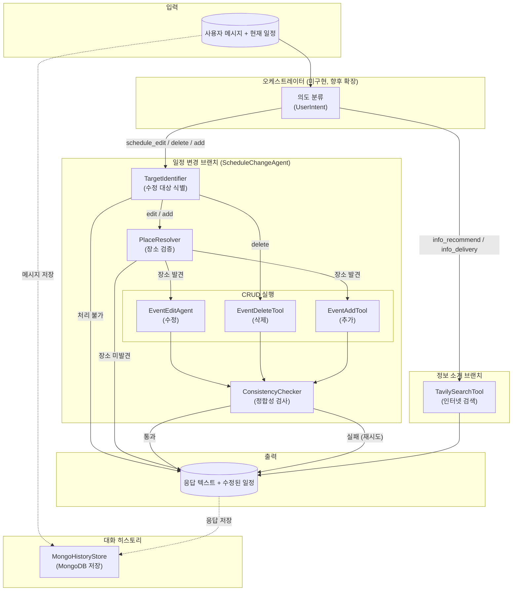
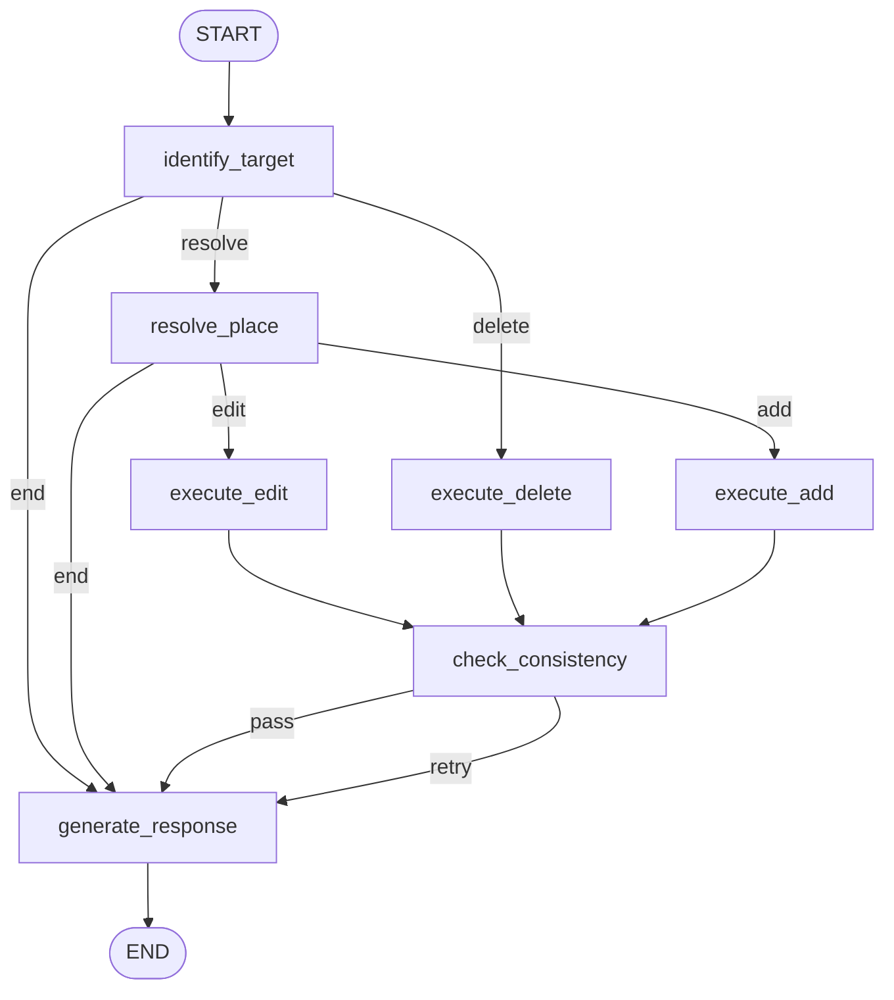

# Chat

## 📁 개요

이 폴더는 **대화형 챗봇 시스템**의 핵심 에이전트들을 포함합니다. LangGraph 기반의 워크플로우를 통해 사용자의 자연어 요청을 분석하여 **일정 변경(추가/수정/삭제)** 또는 **여행 정보 검색**을 수행합니다. 기존 ItineraryPlan 에이전트가 생성한 일정을 사용자가 대화를 통해 후속 수정할 수 있도록 설계되었습니다.

### 아키텍처 개요



#### 플로우 설명

| 단계 | 노드 | 설명 |
|------|------|------|
| 1 | 의도 분류 | 사용자 메시지를 `UserIntent`로 분류 (schedule_edit, schedule_delete, schedule_add, info_recommend 등) |
| 2 | TargetIdentifier | LLM으로 자연어를 분석하여 수정 대상(일차, 이벤트 순서, 수정 유형) 식별 |
| 3 | PlaceResolver | 사용자가 요청한 장소를 SQLite → VectorDB 순서로 검증 |
| 4 | CRUD 실행 | 식별된 액션에 따라 EventEditAgent / EventDeleteTool / EventAddTool 호출 |
| 5 | ConsistencyChecker | 기존 ConstraintValidAgent + ScheduleAgent를 조합하여 시간/예산/균형 정합성 검사 |
| 6 | 응답 생성 | 성공/실패/정합성 피드백을 포함한 최종 응답 텍스트 생성 |

---

## 📂 하위 폴더

| 폴더명 | 설명 |
|--------|------|
| `History/` | MongoDB 기반 대화 히스토리 저장소 |
| `InfoAgent/` | Tavily API 기반 여행 정보 검색 도구 |
| `ScheduleChange/` | 일정 변경 총괄 에이전트 및 CRUD 도구/에이전트 |

---

## 📄 파일 목록

### `ChatState.py`

#### 📝 파일 설명

대화형 챗봇 시스템의 **LangGraph 상태 모델**입니다. 오케스트레이터 및 모든 하위 에이전트가 공유하는 상태를 정의합니다. 사용자 의도 분류, 일정 데이터, 일정 변경 브랜치/정보 소개 브랜치의 중간 결과를 모두 포함합니다.

---

#### 🏗️ Enum: `UserIntent`

**설명**: 사용자 의도를 분류하는 열거형입니다.

| 값 | 설명 |
|----|------|
| `INFO_RECOMMEND` | 여행지/맛집 추천 |
| `INFO_DELIVERY` | 일반 정보 전달 |
| `SCHEDULE_EDIT` | 일정 수정 |
| `SCHEDULE_DELETE` | 일정 삭제 |
| `SCHEDULE_ADD` | 일정 추가 |
| `OFF_TOPIC` | 관련 없는 주제 |
| `UNRESOLVABLE` | 처리 불가 |

---

#### 🏗️ TypedDict: `TargetEventInfo`

**설명**: 수정 대상 이벤트 식별 정보 (TargetIdentifier 출력)

| 필드명 | 타입 | 설명 |
|--------|------|------|
| `day` | `int` | 몇 일차 (1-indexed) |
| `event_index` | `Optional[int]` | 이벤트 순서 (1-indexed). None이면 전체일 |
| `action` | `str` | `"edit"` \| `"delete"` \| `"add"` |
| `detail` | `str` | 사용자 요청 상세 ("맛집으로 변경" 등) |
| `is_resolvable` | `bool` | 처리 가능 여부 |
| `reject_reason` | `Optional[str]` | 처리 불가 시 사유 |
| `target_scope` | `str` | `"single"` \| `"all_day"` |
| `requested_place` | `Optional[str]` | 사용자가 요청한 구체적 장소 이름 |

---

#### 🏗️ TypedDict: `ChatState`

**설명**: 대화형 챗봇 LangGraph 상태. 오케스트레이터 → 하위 에이전트 전체에서 공유됩니다.

| 키 | 타입 | 설명 |
|----|------|------|
| `session_id` | `str` | 대화 세션 ID |
| `messages` | `List[ChatMessage]` | 대화 히스토리 |
| `current_user_message` | `str` | 현재 사용자 입력 |
| `is_on_topic` | `bool` | 관련 주제 여부 |
| `user_intent` | `str` | UserIntent 값 |
| `current_itinerary` | `Optional[ItineraryResponse]` | 현재 일정 (외부 백엔드에서 전달) |
| `target_event` | `Optional[TargetEventInfo]` | 수정 대상 식별 결과 |
| `resolved_place` | `Optional[dict]` | PlaceResolver 검증 결과 |
| `modified_itinerary` | `Optional[ItineraryResponse]` | 변경된 일정 |
| `consistency_feedback` | `Optional[str]` | 정합성 검사 피드백 |
| `consistency_valid` | `bool` | 정합성 통과 여부 |
| `consistency_attempts` | `int` | 정합성 재시도 횟수 |
| `search_results` | `List[dict]` | 검색 결과 목록 (정보 소개 브랜치) |
| `info_sufficient` | `bool` | 정보 충분성 여부 |
| `info_search_attempts` | `int` | 정보 검색 시도 횟수 |
| `response` | `str` | 최종 응답 텍스트 |

---

### `History/MongoHistoryStore.py`

#### 📝 파일 설명

MongoDB 기반 **대화 히스토리 저장소**입니다. `motor`(async MongoDB 드라이버)를 사용하여 세션 단위로 대화 메시지를 저장하고 조회합니다. 지연 연결(lazy connection) 패턴을 사용합니다.

---

#### 🏗️ 클래스: `MongoHistoryStore`

**설명**: 세션 단위로 대화 메시지를 MongoDB에 저장하고 조회합니다.

##### 📌 필드 (Attributes)

| 필드명 | 타입 | 설명 |
|--------|------|------|
| `_uri` | `str` | MongoDB 접속 URI |
| `_db_name` | `str` | 데이터베이스 이름 |
| `_collection_name` | `str` | 컬렉션 이름 (기본값: `"chat_history"`) |
| `_client` | `Optional[AsyncIOMotorClient]` | MongoDB 클라이언트 (지연 연결) |
| `_db` | `Optional[AsyncIOMotorDatabase]` | MongoDB 데이터베이스 인스턴스 |

##### MongoDB Document 구조

```json
{
    "session_id": "str",
    "messages": [
        {"role": "user", "content": "...", "timestamp": "datetime"},
        {"role": "assistant", "content": "...", "timestamp": "datetime"}
    ],
    "metadata": {
        "created_at": "datetime",
        "updated_at": "datetime",
        "message_count": "int"
    }
}
```

##### 🔧 메서드 (Methods)

**`create_session(session_id: str) -> None`** *(비동기)*

- **설명**: 새 대화 세션 document를 MongoDB에 생성합니다.

---

**`add_message(session_id: str, role: str, content: str) -> None`** *(비동기)*

- **설명**: 세션에 메시지를 추가합니다. 세션이 없으면 자동 생성합니다.
- **파라미터**:
  - `role` (`str`): 메시지 역할 (`"user"`, `"assistant"`, `"system"`)
  - `content` (`str`): 메시지 내용

---

**`get_messages(session_id: str, limit: Optional[int] = None) -> List[Dict[str, str]]`** *(비동기)*

- **설명**: 세션의 메시지 히스토리를 조회합니다. `limit`으로 최근 N개만 가져올 수 있습니다.
- **반환값**: `[{"role": ..., "content": ...}]` (timestamp 제외)

---

**`get_session_metadata(session_id: str) -> Optional[Dict]`** *(비동기)*

- **설명**: 세션 메타데이터(생성일, 수정일, 메시지 수)를 조회합니다.

---

**`list_sessions(limit: int = 20) -> List[Dict]`** *(비동기)*

- **설명**: 최근 세션 목록을 `updated_at` 기준 내림차순으로 조회합니다.

---

**`delete_session(session_id: str) -> bool`** *(비동기)*

- **설명**: 세션을 삭제합니다.

---

**`close() -> None`** *(비동기)*

- **설명**: MongoDB 연결을 종료합니다.

---

### `InfoAgent/TavilySearchTool.py`

#### 📝 파일 설명

**Tavily API**를 활용한 인터넷 검색 도구입니다. 여행 정보, 장소 정보 등을 웹에서 검색하여 반환합니다. AI 에이전트에 최적화된 Tavily API를 사용하여 관련도 높은 결과와 자동 요약을 제공합니다.

---

#### 🏗️ 데이터 클래스

**`TavilySearchResult`** (dataclass)

| 필드명 | 타입 | 설명 |
|--------|------|------|
| `title` | `str` | 검색 결과 제목 |
| `url` | `str` | 검색 결과 URL |
| `content` | `str` | 검색 결과 내용 |
| `score` | `float` | 관련도 점수 (기본값: `0.0`) |

**`TavilySearchResponse`** (dataclass)

| 필드명 | 타입 | 설명 |
|--------|------|------|
| `query` | `str` | 검색 쿼리 |
| `results` | `List[TavilySearchResult]` | 검색 결과 리스트 |
| `answer` | `Optional[str]` | AI 생성 답변 |

---

#### 🏗️ 클래스: `TavilySearchTool`

**설명**: Tavily API 기반 인터넷 검색 도구. `httpx` 비동기 클라이언트로 API를 호출합니다.

##### 📌 필드 (Attributes)

| 필드명 | 타입 | 설명 |
|--------|------|------|
| `_api_key` | `str` | Tavily API 키 |
| `_timeout` | `int` | HTTP 요청 타임아웃 (초, 기본값: `30`) |
| `_max_results` | `int` | 검색 결과 최대 개수 (기본값: `5`) |

##### 🔧 메서드 (Methods)

**`search(query: str, search_depth: str = "basic", include_answer: bool = True, max_results: Optional[int] = None) -> TavilySearchResponse`** *(비동기)*

- **설명**: 단일 쿼리로 Tavily API 검색을 수행합니다.
- **파라미터**:
  - `search_depth`: `"basic"` 또는 `"advanced"`
  - `include_answer`: AI 생성 답변 포함 여부

---

**`search_multiple(queries: List[str], ...) -> List[TavilySearchResponse]`** *(비동기)*

- **설명**: 여러 쿼리를 순차 검색합니다.

---

**`format_results_as_text(response: TavilySearchResponse) -> str`**

- **설명**: 검색 결과를 LLM에 전달할 텍스트로 포맷합니다. 각 결과의 제목, URL, 내용(300자)을 포함합니다.

---

### `ScheduleChange/ScheduleChangeAgent.py`

#### 📝 파일 설명

일정 변경 브랜치의 **총괄 오케스트레이터**입니다. LangGraph `StateGraph`를 사용하여 수정 대상 식별 → 장소 검증 → CRUD 실행 → 정합성 검사 → 응답 생성의 전체 파이프라인을 관리합니다.

---

#### 🏗️ 클래스: `ScheduleChangeAgent`

**설명**: 일정 변경 총괄 에이전트. LangGraph StateGraph로 전체 흐름을 관리합니다.

##### 📌 필드 (Attributes)

| 필드명 | 타입 | 설명 |
|--------|------|------|
| `llm_client` | `BaseLLMClient` | LLM 클라이언트 |
| `target_identifier` | `TargetIdentifier` | 수정 대상 식별 모듈 |
| `place_resolver` | `PlaceResolver` | 장소 검증 모듈 |
| `event_edit_agent` | `EventEditAgent` | 이벤트 수정 에이전트 |
| `consistency_checker` | `ConsistencyChecker` | 정합성 검사 모듈 |
| `graph` | `CompiledGraph` | 컴파일된 LangGraph 워크플로우 |

##### 🔧 메서드 (Methods)

**`__init__(llm_client, total_budget, travel_start_date, travel_end_date)`**

- **설명**: ScheduleChangeAgent 인스턴스를 생성하고 모든 컴포넌트를 초기화합니다.
- **파라미터**:
  - `llm_client` (`BaseLLMClient`): vLLM 클라이언트
  - `total_budget` (`int`): 총 예산 (원)
  - `travel_start_date` (`str`): 여행 시작일
  - `travel_end_date` (`str`): 여행 종료일

---

**`run(state: ChatState) -> ChatState`** *(비동기)*

- **설명**: 일정 변경 워크플로우를 실행합니다. Langfuse 콜백을 주입하여 트레이싱합니다.
- **파라미터**: `state` (`ChatState`): 현재 대화 상태
- **반환값**: `ChatState` - 업데이트된 대화 상태 (response, modified_itinerary 등 포함)

---

##### 내부 노드 메서드

| 메서드 | 설명 | 반환값 |
|--------|------|--------|
| `_identify_target` | LLM으로 수정 대상 이벤트 식별 | `{"target_event": TargetEventInfo}` |
| `_resolve_place` | SQLite + VectorDB로 장소 검증 | `{"resolved_place": dict}` |
| `_execute_edit` | EventEditAgent로 이벤트 수정 | `{"modified_itinerary": ItineraryResponse}` |
| `_execute_delete` | EventDeleteTool로 이벤트 삭제 | `{"modified_itinerary": ItineraryResponse}` |
| `_execute_add` | EventAddTool로 이벤트 추가 | `{"modified_itinerary": ItineraryResponse}` |
| `_check_consistency` | 시간/예산/균형 정합성 검사 | `{"consistency_valid": bool, "consistency_feedback": str}` |
| `_generate_response` | 처리 결과 기반 응답 텍스트 생성 | `{"response": str}` |

##### 라우팅 함수

| 함수 | 분기 조건 | 라우팅 결과 |
|------|-----------|-------------|
| `_route_after_identify` | 처리 불가 → `"end"` / delete → `"delete"` / edit,add → `"resolve"` | resolve_place 또는 execute_delete 또는 generate_response |
| `_route_after_resolve` | 장소 미발견 → `"end"` / edit → `"edit"` / add → `"add"` | execute_edit 또는 execute_add 또는 generate_response |
| `_route_after_consistency` | 정합성 통과 → `"pass"` / 실패 → `"retry"` | generate_response |

##### LangGraph 워크플로우



---

### `ScheduleChange/TargetIdentifier.py`

#### 📝 파일 설명

사용자 자연어 요청에서 **수정 대상 이벤트를 식별**하는 노드입니다. vLLM의 structured output(`call_llm_structured`)을 활용하여 "2일차 두번째 일정을 맛집으로 바꿔줘" 같은 자연어를 구조화된 `TargetEventInfo`로 변환합니다.

---

#### 🏗️ Pydantic 모델: `TargetIdentifierResult`

**설명**: LLM이 출력하는 수정 대상 식별 결과. Pydantic `model_validator`로 필수 필드 검증을 수행합니다.

| 필드명 | 타입 | 설명 |
|--------|------|------|
| `is_resolvable` | `bool` | 처리 가능 여부 |
| `reject_reason` | `Optional[str]` | 처리 불가 사유 |
| `action` | `Optional[Literal["edit","delete","add"]]` | 수정 유형 |
| `day` | `Optional[int]` | 대상 일차 (1-indexed) |
| `event_index` | `Optional[int]` | 이벤트 순서 (1-indexed, POI 기준) |
| `target_scope` | `Literal["single","all_day"]` | 대상 범위 |
| `requested_place` | `Optional[str]` | 구체적 장소 이름 (추상적 표현이면 null) |
| `detail` | `Optional[str]` | 사용자 요청 요약 |

---

#### 🏗️ 클래스: `TargetIdentifier`

**설명**: 사용자의 자연어 요청과 현재 일정을 분석하여 구체적인 수정 대상을 식별합니다.

##### 🔧 메서드 (Methods)

**`identify(user_message: str, itinerary: ItineraryResponse) -> TargetEventInfo`** *(비동기)*

- **설명**: 자연어 요청을 분석하여 수정 대상을 식별합니다. LLM structured output 사용.
- **파라미터**:
  - `user_message` (`str`): 사용자 요청 메시지
  - `itinerary` (`ItineraryResponse`): 현재 일정
- **반환값**: `TargetEventInfo` - 식별된 수정 대상 정보
- **예외 처리**: LLM 호출 실패 시 `is_resolvable=False`인 TargetEventInfo 반환

---

### `ScheduleChange/PlaceResolver.py`

#### 📝 파일 설명

사용자가 요청한 장소를 **DB에서 검증**하는 모듈입니다. SQLite(PoiAliasCache) → VectorDB(ChromaDB) 순서로 검색하여 Google Place ID와 상세 PoiData를 제공합니다.

---

#### 🏗️ 데이터 클래스: `ResolvedPlace`

| 필드명 | 타입 | 설명 |
|--------|------|------|
| `place_name` | `str` | 검색에 사용된 장소 이름 |
| `google_place_id` | `Optional[str]` | Google Place ID |
| `source` | `str` | `"sqlite"` \| `"vectordb"` \| `"google_maps"` |
| `is_found` | `bool` | 검색 성공 여부 |
| `poi_data` | `Optional[PoiData]` | VectorDB에서 가져온 상세 데이터 |

---

#### 🏗️ 클래스: `PlaceResolver`

**설명**: 장소 검증 모듈. 기존 PoiAliasCache와 VectorSearchAgent를 재활용합니다.

##### 검색 흐름

```
1. PoiAliasCache (SQLite) — find_by_name()으로 google_place_id 조회
   └─ 실패 시 → is_found=False 반환
2. VectorSearchAgent (ChromaDB) — google_place_id로 상세 PoiData 조회
   └─ 성공 시 → source="vectordb", poi_data 포함
   └─ 실패 시 → source="sqlite", 기본 정보만 반환
3. (향후 확장) Google Maps API — 실시간 검색 (미구현)
```

##### 🔧 메서드 (Methods)

**`resolve(place_name: str, city: str = "") -> ResolvedPlace`** *(비동기)*

- **설명**: 장소 이름으로 DB 검색을 수행합니다.
- **반환값**: `ResolvedPlace` - 검증 결과 (상세 PoiData 포함 가능)

---

### `ScheduleChange/EventEditAgent.py`

#### 📝 파일 설명

vLLM을 활용하여 일정 이벤트를 **수정**하는 에이전트입니다. 검증된 장소(resolved_place)가 있으면 직접 교체하고, 없으면 LLM으로 수정 계획을 생성하여 적용합니다.

---

#### 🏗️ Pydantic 모델: `EditPlan`

**설명**: LLM이 생성하는 수정 계획

| 필드명 | 타입 | 설명 |
|--------|------|------|
| `edit_type` | `str` | `"replace_event"` \| `"change_time"` \| `"change_duration"` \| `"swap_events"` |
| `target_day` | `int` | 대상 일차 (1-indexed) |
| `target_event_index` | `int` | 대상 이벤트 순서 (1-indexed) |
| `new_place_name` | `Optional[str]` | 교체할 장소 이름 |
| `new_place_type` | `Optional[str]` | 교체할 장소 타입 |
| `new_start_time` | `Optional[str]` | 변경할 시작 시간 (HH:MM) |
| `new_duration` | `Optional[int]` | 변경할 체류 시간 (분) |
| `swap_with_index` | `Optional[int]` | 교환할 이벤트 순서 |
| `reasoning` | `str` | 수정 이유 |

---

#### 🏗️ 클래스: `EventEditAgent`

**설명**: 이벤트 수정 에이전트. 단건 수정과 전체일 교체를 모두 지원합니다.

##### 🔧 메서드 (Methods)

**`edit(itinerary, day, event_index, user_request, target_scope, resolved_place) -> tuple[ItineraryResponse, Optional[str]]`** *(비동기)*

- **설명**: 이벤트 수정을 실행합니다.
- **동작 방식**:
  1. `resolved_place`가 있으면 → 바로 교체 (`_replace_with_resolved`)
  2. 없으면 → LLM으로 `EditPlan` 생성 → `_apply_edit_plan`으로 적용
- **반환값**: (수정된 일정, 에러 메시지 또는 None)

##### 지원 수정 유형

| edit_type | 설명 |
|-----------|------|
| `replace_event` | 특정 이벤트를 다른 장소로 교체 |
| `change_time` | 시작 시간 변경 |
| `change_duration` | 체류 시간 변경 |
| `swap_events` | 두 이벤트의 순서 교환 |

---

### `ScheduleChange/EventDeleteTool.py`

#### 📝 파일 설명

ItineraryResponse에서 이벤트를 **삭제**하는 도구입니다. 단건 삭제 및 전체일(all_day) 삭제를 지원하며, 삭제 후 고아 route 정리와 eventOrder 재정렬을 자동 수행합니다.

---

#### 🏗️ 클래스: `EventDeleteTool`

**설명**: 이벤트 삭제 도구. 모든 메서드가 `@staticmethod`입니다.

##### 🔧 메서드 (Methods)

**`delete(itinerary, day, event_index, target_scope) -> tuple[ItineraryResponse, Optional[str]]`** *(정적)*

- **설명**: 이벤트 삭제를 실행합니다. 원본은 수정하지 않습니다 (`deepcopy`).
- **파라미터**:
  - `day` (`int`): 삭제할 일차 (1-indexed)
  - `event_index` (`Optional[int]`): 이벤트 순서 (1-indexed, POI 기준)
  - `target_scope` (`str`): `"single"` (단건) 또는 `"all_day"` (전체일)
- **부수 효과**: 고아 route 제거 + eventOrder 재정렬

---

### `ScheduleChange/EventAddTool.py`

#### 📝 파일 설명

ItineraryResponse에 새 이벤트를 **추가**하는 도구입니다. 지정된 일차와 위치에 새 Activity를 삽입하고, 전후 route placeholder를 배치합니다. 검증된 장소 정보(resolved_place)로 Activity를 생성할 수 있습니다.

---

#### 🏗️ 클래스: `EventAddTool`

**설명**: 이벤트 추가 도구. 모든 메서드가 `@staticmethod`입니다.

##### 🔧 메서드 (Methods)

**`add(itinerary, day, activity, position) -> tuple[ItineraryResponse, Optional[str]]`** *(정적)*

- **설명**: 이벤트 추가를 실행합니다. 원본은 수정하지 않습니다 (`deepcopy`).
- **파라미터**:
  - `day` (`int`): 추가할 일차 (1-indexed)
  - `activity` (`ActivityResponse`): 추가할 Activity
  - `position` (`Optional[int]`): 삽입 위치 (1-indexed, POI 기준). None이면 마지막에 추가
- **부수 효과**: POI 간 route placeholder 삽입 + eventOrder 재정렬

---

**`create_activity_from_resolved(resolved_place: dict, duration: int = 60, activity_type: str = "attraction") -> ActivityResponse`** *(정적)*

- **설명**: 검증된 장소 정보(PlaceResolver 결과)로 ActivityResponse를 생성합니다. VectorDB 상세 데이터(poi_detail)가 있으면 카테고리, URL, 평점 등을 활용합니다.

---

### `ScheduleChange/ConsistencyChecker.py`

#### 📝 파일 설명

변경된 일정의 **정합성을 검증**하는 통합 모듈입니다. 기존 `ConstraintValidAgent`(시간/예산)와 `ScheduleAgent`(일정 균형)를 조합하여 검증합니다. `ItineraryResponse` → `Itinerary` 도메인 모델 변환을 내부에서 처리합니다.

---

#### 🏗️ 클래스: `ConsistencyChecker`

**설명**: 정합성 검사 통합기.

##### 📌 필드 (Attributes)

| 필드명 | 타입 | 설명 |
|--------|------|------|
| `_constraint_agent` | `ConstraintValidAgent` | 시간/예산/날짜 제약 조건 검증 |
| `_schedule_agent` | `ScheduleAgent` | 일정 균형 분석 |
| `_total_budget` | `int` | 총 예산 (원, 기본값: `1,000,000`) |
| `_travel_start_date` | `str` | 여행 시작일 (YYYY-MM-DD) |
| `_travel_end_date` | `str` | 여행 종료일 (YYYY-MM-DD) |

##### 🔧 메서드 (Methods)

**`check(itinerary_response: ItineraryResponse) -> tuple[bool, Optional[str]]`**

- **설명**: 정합성 검사를 실행합니다.
- **검사 항목**:
  1. 제약 조건 검증 (시간 / 예산 / 날짜)
  2. 일정 균형 분석
- **반환값**: (정합성 통과 여부, 피드백 또는 None)

##### 상수

| 상수 | 값 | 설명 |
|------|---|------|
| `MAX_CONSISTENCY_ATTEMPTS` | `3` | 정합성 재시도 최대 횟수 |

---

## 🔗 의존성

### 외부 라이브러리

- `langgraph`: 워크플로우 그래프 (`StateGraph`, `END`)
- `motor`: 비동기 MongoDB 드라이버
- `httpx`: 비동기 HTTP 클라이언트 (Tavily API)
- `pydantic`: 데이터 검증 및 structured output (`BaseModel`, `model_validator`)
- `langfuse`: LLM 트레이싱 (`@observe`)

### 내부 모듈

- `app.core.LLMClient.BaseLlmClient`: LLM 추상 클래스
- `app.core.models.LlmClientDataclass.ChatMessageDataclass`: 메시지 데이터 모델
- `app.core.models.PoiAgentDataclass.poi`: POI 데이터 모델 (`PoiData`, `PoiCategory`, `PoiSource`)
- `app.core.models.ItineraryAgentDataclass.itinerary`: 일정 도메인 모델 (`Itinerary`)
- `app.schemas.Itinerary`: API 응답 모델 (`ItineraryResponse`, `DayItineraryResponse`, `ActivityResponse`)
- `app.core.Agents.Poi.PoiAliasCache`: SQLite 기반 장소 캐시
- `app.core.Agents.Poi.VectorDB.VectorSearchAgent`: ChromaDB 벡터 검색
- `app.core.Agents.ItineraryPlan.ConstraintValidAgent`: 제약 조건 검증 (기존 재활용)
- `app.core.Agents.ItineraryPlan.ScheduleAgent`: 일정 균형 분석 (기존 재활용)
- `app.core.config`: 설정 (API 키, MongoDB URI 등)
- `app.core.langfuse_setup`: Langfuse 핸들러

---

## 📊 상태 스키마 (`ChatState`)

| 키 | 타입 | 설명 |
|----|------|------|
| `session_id` | `str` | 대화 세션 ID |
| `messages` | `List[ChatMessage]` | 대화 히스토리 |
| `current_user_message` | `str` | 현재 사용자 입력 |
| `is_on_topic` | `bool` | 관련 주제 여부 |
| `user_intent` | `str` | UserIntent 값 |
| `current_itinerary` | `Optional[ItineraryResponse]` | 현재 일정 |
| `target_event` | `Optional[TargetEventInfo]` | 수정 대상 식별 결과 |
| `resolved_place` | `Optional[dict]` | PlaceResolver 검증 결과 |
| `modified_itinerary` | `Optional[ItineraryResponse]` | 변경된 일정 |
| `consistency_feedback` | `Optional[str]` | 정합성 검사 피드백 |
| `consistency_valid` | `bool` | 정합성 통과 여부 |
| `consistency_attempts` | `int` | 정합성 재시도 횟수 |
| `search_results` | `List[dict]` | 검색 결과 목록 |
| `info_sufficient` | `bool` | 정보 충분성 여부 |
| `info_search_attempts` | `int` | 정보 검색 시도 횟수 |
| `response` | `str` | 최종 응답 텍스트 |

---

## 📝 설계 특이사항

### 기존 모듈 재활용

- `ConsistencyChecker`는 기존 `ConstraintValidAgent`와 `ScheduleAgent`를 **수정 없이 import**하여 호출만 합니다.
- `PlaceResolver`는 기존 `PoiAliasCache`(SQLite)와 `VectorSearchAgent`(ChromaDB)를 재활용합니다.
- API 모델(`ItineraryResponse`) ↔ 도메인 모델(`Itinerary`) 변환은 `ConsistencyChecker` 내부에서 처리합니다.

### immutable 원칙

- `EventDeleteTool`, `EventAddTool`, `EventEditAgent`는 모두 `deepcopy`를 사용하여 **원본 일정을 수정하지 않습니다**.

### LLM 활용 범위

| 컴포넌트 | LLM 사용 | 용도 |
|-----------|----------|------|
| `TargetIdentifier` | O | 자연어 → 구조화된 수정 대상 식별 (structured output) |
| `EventEditAgent` | O | 수정 계획 생성 (resolved_place 없을 때만) |
| `EventDeleteTool` | X | 순수 데이터 조작 |
| `EventAddTool` | X | 순수 데이터 조작 |
| `ConsistencyChecker` | X | 규칙 기반 검증 |
| `PlaceResolver` | X | DB 조회 |

### 향후 확장 포인트

- **오케스트레이터**: `UserIntent` 기반의 상위 라우터가 아직 구현되지 않았습니다. 현재는 `ScheduleChangeAgent`가 독립 실행됩니다.
- **Google Maps API fallback**: `PlaceResolver._search_google_maps()`가 구조만 준비되어 있습니다 (`NotImplementedError`).
- **정합성 재시도 루프**: `_route_after_consistency`에서 `"retry"` 분기가 `generate_response`로 바로 연결되어, 실제 재수정 루프는 아직 구현되지 않았습니다.
