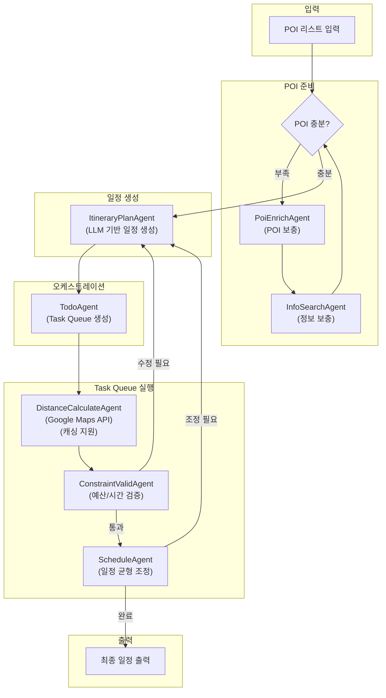

# ItineraryPlan

## 📁 개요

이 폴더는 **여행 일정 생성 및 최적화 시스템**의 핵심 에이전트들을 포함합니다. LangGraph 기반의 워크플로우를 통해 POI 리스트를 분석하여 최적의 여행 일정을 생성하고, 예산/시간 제약을 검증하며, 일정을 균형있게 조정합니다.

### 아키텍처 개요

---

## 📄 파일 목록

### `Planner.py`

#### 📝 파일 설명

여행 일정 생성 워크플로우의 **메인 오케스트레이터**입니다. LangGraph의 `StateGraph`를 사용하여 전체 일정 생성 파이프라인을 정의하고 실행합니다. POI 충분성 확인, 일정 생성, Task Queue 기반 실행, 제약 검증, 일정 조정까지 전체 흐름을 조율합니다.

---

#### 🏗️ 클래스: `Planner`

**설명**: 여행 일정 생성 워크플로우를 정의하고 실행하는 메인 클래스입니다.

##### 📌 필드 (Attributes)

| 필드명 | 타입 | 설명 |
|--------|------|------|
| `todo_agent` | `TodoAgent` | Task Queue 생성 에이전트 |
| `itinerary_plan_agent` | `ItineraryPlanAgent` | LLM 기반 일정 생성 에이전트 |
| `distance_calculate_agent` | `DistanceCalculateAgent` | 거리/시간 계산 에이전트 |
| `constraint_valid_agent` | `ConstraintValidAgent` | 제약 조건 검증 에이전트 |
| `schedule_agent` | `ScheduleAgent` | 일정 균형 조정 에이전트 |
| `poi_enrich_agent` | `PoiEnrichAgent` | POI 보충 에이전트 |
| `graph` | `CompiledGraph` | 컴파일된 LangGraph 워크플로우 |
| `MAX_ITERATIONS` | `int` | 최대 반복 횟수 (기본값: `5`) |

##### 🔧 메서드 (Methods)

**`__init__(llm_client, poi_graph, google_maps_api_key)`**

- **설명**: Planner 인스턴스를 생성하고 모든 컴포넌트를 초기화합니다.
- **파라미터**:
  - `llm_client` (`BaseLLMClient`): LLM 클라이언트
  - `poi_graph` (`Optional[PoiGraph]`): POI 검색 그래프 (POI 보충용)
  - `google_maps_api_key` (`Optional[str]`): Google Maps API 키

---

**`run(pois, travel_destination, travel_start_date, travel_end_date, total_budget, persona_summary) -> List[Itinerary]`** *(비동기)*

- **설명**: 여행 일정 생성 워크플로우를 실행합니다.
- **파라미터**:
  - `pois` (`List[PoiInfo]`): POI 리스트
  - `travel_destination` (`str`): 여행지
  - `travel_start_date` (`str`): 여행 시작일 (YYYY-MM-DD)
  - `travel_end_date` (`str`): 여행 종료일 (YYYY-MM-DD)
  - `total_budget` (`int`): 총 예산
  - `persona_summary` (`str`): 사용자 페르소나
- **반환값**: `List[Itinerary]` - 최종 여행 일정

> ⚠️ **Fallback 전략**: 5회 반복 후에도 제약 조건을 만족하지 못하면, 가장 위반이 적은 `best_itineraries`를 반환합니다.

---

### `ItineraryPlanAgent.py`

#### 📝 파일 설명

LLM을 활용하여 **POI 리스트를 날짜별로 배치**하는 에이전트입니다. POI 순서와 날짜만 결정하며, 실제 이동 시간/거리(Transfer)는 생성하지 않습니다.

---

#### 🏗️ 클래스: `ItineraryPlanAgent`

##### 📌 필드 (Attributes)

| 필드명 | 타입 | 설명 |
|--------|------|------|
| `llm` | `BaseLLMClient` | LLM 클라이언트 인스턴스 |
| `SYSTEM_PROMPT` | `str` | 일정 생성용 시스템 프롬프트 |

##### 🔧 메서드 (Methods)

**`generate(pois, travel_destination, travel_start_date, travel_end_date, persona_summary, feedback) -> List[Itinerary]`** *(비동기)*

- **설명**: POI 리스트로 일정을 생성합니다.
- **반환값**: `List[Itinerary]` - 생성된 일정 (transfers는 빈 리스트)

**`refine(current_itineraries, pois, ..., feedback) -> List[Itinerary]`** *(비동기)*

- **설명**: 피드백을 반영하여 일정을 수정합니다.

---

### `DistanceCalculateAgent.py`

#### 📝 파일 설명

**Google Maps Directions API**를 이용하여 POI 간 이동 시간과 거리를 계산하는 에이전트입니다. 캐싱을 지원하여 API 호출 비용을 절감합니다.

---

#### 🏗️ 클래스: `DistanceCalculateAgent`

##### 📌 필드 (Attributes)

| 필드명 | 타입 | 설명 |
|--------|------|------|
| `api_key` | `str` | Google Maps API 키 |
| `_cache` | `Dict[str, Transfer]` | 이동 정보 캐시 |
| `GOOGLE_MAPS_DIRECTIONS_URL` | `str` | API 엔드포인트 |

##### 🔧 메서드 (Methods)

**`calculate(from_poi, to_poi, mode) -> Transfer`** *(비동기)*

- **설명**: 두 POI 간 이동 정보를 계산합니다 (캐시 우선 조회).
- **반환값**: `Transfer` - 이동 정보

**`calculate_batch(pois, mode) -> List[Transfer]`** *(비동기)*

- **설명**: POI 리스트의 연속 구간별 이동 정보를 일괄 계산합니다.
- **반환값**: `List[Transfer]` - 이동 정보 리스트 (len(pois) - 1 개)

**`clear_cache() -> None`**

- **설명**: 캐시를 초기화합니다.

---

### `ConstraintValidAgent.py`

#### 📝 파일 설명

**예산/시간 제약 조건**을 검증하는 에이전트입니다. 독립적으로 호출 가능하며, 구체적인 수정 피드백을 반환합니다.

---

#### 🏗️ 클래스: `ConstraintValidAgent`

##### 📌 필드 (Attributes)

| 필드명 | 타입 | 설명 |
|--------|------|------|
| `max_daily_minutes` | `int` | 하루 최대 활동 시간 (기본값: `720분`) |

##### 🔧 메서드 (Methods)

**`validate(itineraries, total_budget, travel_start_date, travel_end_date) -> Optional[str]`**

- **설명**: 일정의 제약 조건을 검증합니다.
- **반환값**: 수정 필요 시 피드백 문자열, 통과 시 `None`

##### 검증 항목

| 항목 | 설명 |
|------|------|
| 예산 검증 | POI 개수 기반 예상 비용 계산 |
| 시간 검증 | 일일 최대 시간 초과 여부 |
| 날짜 검증 | 여행 기간 내 일정 여부 |

---

### `ScheduleAgent.py`

#### 📝 파일 설명

**일정 균형을 조정**하는 에이전트입니다. 하루 POI가 과다하면 다른 날로 이전하거나 삭제를 제안합니다.

---

#### 🏗️ 클래스: `ScheduleAgent`

##### 📌 필드 (Attributes)

| 필드명 | 타입 | 설명 |
|--------|------|------|
| `optimal_poi_count` | `int` | 하루 최적 POI 개수 (기본값: `4`) |
| `max_poi_count` | `int` | 하루 최대 POI 개수 (기본값: `6`) |

##### 🔧 메서드 (Methods)

**`analyze(itineraries) -> Optional[str]`**

- **설명**: 일정 균형을 분석하고 조정 방안을 제안합니다.
- **반환값**: 조정 필요 시 피드백 문자열, 통과 시 `None`

---

### `TodoAgent.py`

#### 📝 파일 설명

**Task Queue 기반 오케스트레이터**입니다. 현재 상태를 분석하여 실행할 태스크 목록을 생성합니다. LLM 호출 없이 Rule-based 로직으로 빠르게 결정합니다.

---

#### 🏗️ 클래스: `TodoAgent`

##### 에이전트 이름 상수

| 상수 | 값 |
|------|------|
| `DISTANCE_CALCULATE` | `"DistanceCalculateAgent"` |
| `CONSTRAINT_VALID` | `"ConstraintValidAgent"` |
| `SCHEDULE` | `"ScheduleAgent"` |
| `ITINERARY_PLAN` | `"ItineraryPlanAgent"` |

##### 🔧 메서드 (Methods)

**`plan_tasks(state) -> List[str]`**

- **설명**: 현재 상태를 분석하여 실행할 Task Queue를 생성합니다.
- **반환값**: 에이전트 이름 리스트 (FIFO 순서)

**`get_next_task(state) -> Optional[str]`**

- **설명**: 큐에서 다음 태스크를 가져옵니다.

**`is_complete(state) -> bool`**

- **설명**: 모든 태스크가 완료되었는지 확인합니다.

**`check_poi_changed(current_poi_ids, previous_poi_ids) -> bool`**

- **설명**: POI 목록 변경 여부를 확인합니다.

---

### `PoiEnrichAgent.py`

#### 📝 파일 설명

**POI가 부족할 때 PoiGraph를 호출**하여 추가 POI를 생성하는 에이전트입니다.

---

#### 🏗️ 클래스: `PoiEnrichAgent`

##### 📌 필드 (Attributes)

| 필드명 | 타입 | 설명 |
|--------|------|------|
| `poi_graph` | `PoiGraph` | POI 검색 그래프 |
| `min_poi_count` | `int` | 최소 필요 POI 개수 (기본값: `5`) |

##### 🔧 메서드 (Methods)

**`is_poi_sufficient(pois) -> bool`**

- **설명**: POI 개수가 충분한지 확인합니다.

**`enrich(current_pois, persona_summary, travel_destination) -> List[PoiInfo]`** *(비동기)*

- **설명**: POI를 보충합니다. `PoiGraph.run()`이 `List[PoiData]`를 반환하면 `_convert_to_poi_info()`로 변환합니다.
- **반환값**: 보충된 POI 리스트 (기존 + 새로운)

**`_convert_to_poi_info(poi_data: PoiData) -> PoiInfo`** *(정적 메서드)*

- **설명**: `PoiData`를 `PoiInfo`로 변환합니다. Google Maps 데이터(rating, price_level, address 등)를 활용합니다.

---

### `InfoSearchAgent.py`

#### 📝 파일 설명

**POI 정보가 부족할 때 웹 검색**으로 보충하는 에이전트입니다.

---

#### 🏗️ 클래스: `InfoSearchAgent`

##### 🔧 메서드 (Methods)

**`needs_enrichment(poi) -> bool`**

- **설명**: POI 정보 보충이 필요한지 확인합니다 (주소/설명 누락 시).

**`enrich_poi(poi) -> PoiInfo`** *(비동기)*

- **설명**: 단일 POI 정보를 보충합니다.

**`enrich_pois(pois) -> List[PoiInfo]`** *(비동기)*

- **설명**: 여러 POI 정보를 일괄 보충합니다.

---

## 🔗 의존성

### 외부 라이브러리
- `langgraph`: 워크플로우 그래프 (`StateGraph`, `END`)
- `httpx`: Google Maps API 호출
- `asyncio`: 비동기 처리
- `pydantic`: 데이터 모델

### 내부 모듈
- `app.core.LLMClient.BaseLlmClient`: LLM 추상 클래스
- `app.core.models.ItineraryAgentDataclass.itinerary`: 데이터 모델
- `app.core.models.PoiAgentDataclass.poi`: POI 데이터 모델
- `app.core.config`: 설정 (API 키 등)

---

## 📊 상태 스키마 (`ItineraryPlanState`)

| 키 | 타입 | 설명 |
|----|------|------|
| `pois` | `List[PoiInfo]` | POI 리스트 |
| `travel_destination` | `str` | 여행지 |
| `travel_start_date` | `str` | 여행 시작일 |
| `travel_end_date` | `str` | 여행 종료일 |
| `total_budget` | `int` | 총 예산 |
| `persona_summary` | `str` | 사용자 페르소나 |
| `itineraries` | `List[Itinerary]` | 생성된 일정 |
| `validation_feedback` | `Optional[str]` | 검증 피드백 |
| `schedule_feedback` | `Optional[str]` | 일정 조정 피드백 |
| `iteration_count` | `int` | 반복 횟수 |
| `previous_poi_ids` | `List[str]` | 이전 POI ID 목록 |
| `is_poi_changed` | `bool` | POI 변경 여부 |
| `best_itineraries` | `Optional[List[Itinerary]]` | Fallback용 최선 일정 |
| `task_queue` | `List[str]` | 실행할 태스크 큐 |
| `current_task` | `Optional[str]` | 현재 실행 중인 태스크 |

---

## 📝 변경 이력

### 2026-01-31
- `PoiEnrichAgent._convert_to_poi_info()`: `PoiSearchResult` → `PoiData` 입력으로 변경
  - Google Maps 데이터(category, address, google_rating, price_level) 활용
  - 불필요한 `uuid`, `PoiSearchResult`, `PoiCategory` import 제거

### 2026-01-27
- 초기 구현
- 데이터 모델: `Transfer`, `Itinerary`, `ItineraryPlanState`
- 에이전트: `Planner`, `ItineraryPlanAgent`, `DistanceCalculateAgent`, `ConstraintValidAgent`, `ScheduleAgent`, `TodoAgent`, `PoiEnrichAgent`, `InfoSearchAgent`
- Google Maps API 연동 및 캐싱 지원
- Task Queue 기반 연속 작업 구조
- Fallback 전략 (5회 반복 후 최선 결과 반환)
