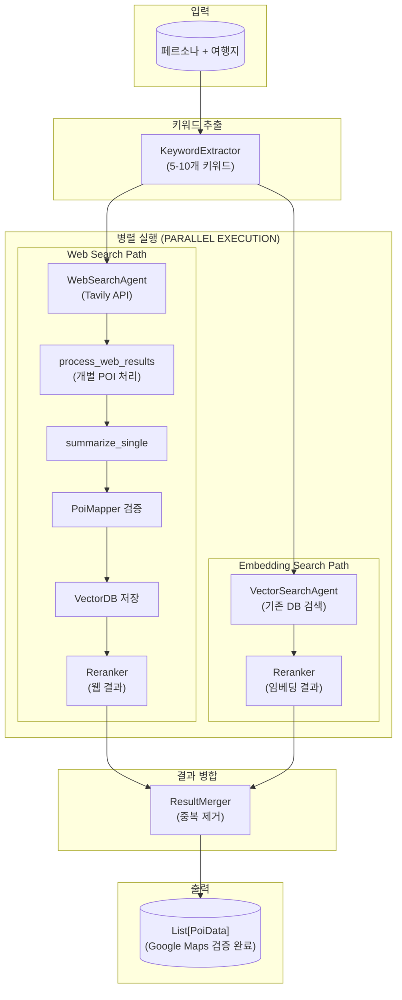

# Poi

## 📁 개요

이 폴더는 **POI(Point of Interest) 검색 및 추천 시스템**의 핵심 에이전트들을 포함합니다. LangGraph 기반의 워크플로우를 통해 사용자 페르소나를 분석하여 키워드를 추출하고, 웹 검색 및 벡터 DB 검색을 수행한 후 결과를 리랭킹하고 병합하여 최종 POI 추천 목록을 생성합니다.

### 아키텍처 개요

#### 플로우 설명

| 단계 | 노드 | 설명 |
|------|------|------|
| 1 | KeywordExtractor | 페르소나에서 검색 키워드 5-10개 추출 |
| 2a | WebSearchAgent | Tavily API로 웹 검색 수행 |
| 2b | VectorSearchAgent | 기존 VectorDB에서 유사 POI 검색 |
| 3 | process_web_results | 웹 결과를 개별 처리 (요약→검증→저장) |
| 4 | Reranker (x2) | 각 경로의 결과를 페르소나 기반 리랭킹 |
| 5 | ResultMerger | 양쪽 결과 병합 및 중복 제거 |
| 6 | Output | `poi_data_map`에서 조회한 `List[PoiData]` 반환 |

---

## 📂 하위 폴더

| 폴더명 | 설명 |
|--------|------|
| [`VectorDB/`](./VectorDB/VectorDB.md) | 벡터 DB 검색 에이전트 (ChromaDB 기반) |
| [`WebSearch/`](./WebSearch/WebSearch.md) | 웹 검색 에이전트 (Tavily API 기반) |
| [`QueryExtention/`](./QueryExtention/QueryExtention.md) | 키워드 추출 모듈 |
| [`Reranker/`](./Reranker/Reranker.md) | 페르소나 기반 리랭킹 모듈 |
| [`PoiMapper/`](./PoiMapper/PoiMapper.md) | POI 검증 및 Google Maps 매핑 모듈 |
| [`VectorDB/EmbeddingPipeline/`](./VectorDB/EmbeddingPipeline/EmbeddingPipeline.md) | POI 데이터 VectorDB 동기화 파이프라인 |

---

## 📄 파일 목록

### `PoiGraph.py`

#### 📝 파일 설명

POI 검색 워크플로우의 **메인 오케스트레이터**입니다. LangGraph의 `StateGraph`를 사용하여 전체 검색 파이프라인을 정의하고 실행합니다. 웹 검색과 임베딩 검색을 **병렬로 실행**하고, 웹 검색 결과는 개별 POI 단위로 처리하여 즉시 VectorDB에 저장합니다.

---

#### 🏗️ 클래스: `PoiGraph`

**설명**: POI 검색 워크플로우 그래프를 정의하고 실행하는 메인 클래스입니다.

##### 📌 필드 (Attributes)

| 필드명 | 타입 | 설명 |
|--------|------|------|
| `keyword_extractor` | `QueryExtension` | 페르소나에서 키워드를 추출하는 모듈 |
| `web_search` | `WebSearchAgent` | 웹 검색 에이전트 |
| `vector_search` | `VectorSearchAgent` | 벡터 DB 검색 에이전트 |
| `result_merger` | `ResultMerger` | 검색 결과 병합 모듈 |
| `info_summarizer` | `InfoSummarizeAgent` | 정보 요약 및 추천 생성 에이전트 |
| `reranker` | `Reranker` | 페르소나 기반 리랭킹 모듈 |
| `poi_mapper` | `GoogleMapsPoiMapper` | POI 검증 및 Google Maps 매핑 모듈 |
| `graph` | `CompiledGraph` | 컴파일된 LangGraph 워크플로우 |

##### 🔧 메서드 (Methods)

**`__init__(llm_client, web_search_api_key, vector_db_path, web_weight, embedding_weight, rerank_top_n, keyword_k, embedding_k, web_search_k, final_poi_count)`**

- **설명**: PoiGraph 인스턴스를 생성하고 모든 컴포넌트를 초기화합니다.
- **파라미터**:
  - `llm_client` (`BaseLLMClient`): LLM 클라이언트
  - `web_search_api_key` (`Optional[str]`): Tavily API 키
  - `vector_db_path` (`Optional[str]`): 벡터 DB 영구 저장 경로
  - `web_weight` (`float`, 기본값: `0.6`): 웹 검색 결과 가중치
  - `embedding_weight` (`float`, 기본값: `0.4`): 임베딩 검색 결과 가중치
  - `rerank_top_n` (`int`, 기본값: `10`): 리랭킹 후 반환할 상위 결과 수
  - `keyword_k` (`int`, 기본값: `10`): 임베딩 검색에 사용할 키워드 수
  - `embedding_k` (`int`, 기본값: `10`): 임베딩 검색 결과 수
  - `web_search_k` (`int`, 기본값: `20`): 웹 검색 결과 수
  - `final_poi_count` (`int`, 기본값: `15`): 최종 POI 개수 제한

---

**`run(persona_summary: str, travel_destination: str, save_path: Optional[str] = None) -> List[PoiData]`** *(비동기)*

- **설명**: POI 검색 워크플로우를 실행합니다.
- **파라미터**:
  - `persona_summary` (`str`): 사용자 페르소나 요약
  - `travel_destination` (`str`): 여행 도시 (지역 필터링용)
  - `save_path` (`Optional[str]`): 전체 상태를 JSON으로 저장할 경로 (선택)
- **반환값**: `List[PoiData]` - Google Maps 검증 완료된 최종 POI 데이터 목록

---

**`save_state_to_json(state: PoiAgentState, file_path: str) -> bool`**

- **설명**: PoiAgentState 전체를 JSON 파일로 저장합니다.
- **파라미터**:
  - `state` (`PoiAgentState`): 저장할 전체 상태
  - `file_path` (`str`): 저장할 파일 경로
- **반환값**: `bool` - 저장 성공 여부

---

##### 내부 노드 메서드

| 메서드 | 설명 | 반환값 |
|--------|------|--------|
| `_extract_keywords` | 페르소나에서 검색 키워드 추출 | `{"keywords": List[str]}` |
| `_web_search` | 추출된 키워드로 웹 검색 수행 | `{"web_results": List[PoiSearchResult]}` |
| `_process_web_results` | **개별 POI 처리** (요약 → 검증 → VectorDB 저장) | `{"web_results": ..., "poi_data_map": Dict[str, PoiData]}` |
| `_embedding_search` | 키워드로 벡터 DB 검색 + PoiData 복원 | `{"embedding_results": ..., "poi_data_map": Dict[str, PoiData]}` |
| `_rerank_web` | 웹 검색 결과 페르소나 기반 리랭킹 | `{"reranked_web_results": List[PoiSearchResult]}` |
| `_rerank_embedding` | 임베딩 검색 결과 페르소나 기반 리랭킹 | `{"reranked_embedding_results": List[PoiSearchResult]}` |
| `_merge_results` | 리랭킹된 결과 병합 + PoiData 조립 | `{"merged_results": ..., "final_poi_data": List[PoiData]}` |

##### `_process_web_results` 노드 상세

이 노드는 웹 검색 결과를 **개별 POI 단위**로 처리합니다:

1. **개별 요약**: `InfoSummarizeAgent.summarize_single()`로 각 POI의 PoiInfo 생성
2. **Google Maps 검증**: `PoiMapper.map_poi()`로 POI 검증 및 PoiData 변환
3. **poi_id 생성**: URL의 MD5 해시를 poi_id로 사용
4. **VectorDB 저장**: 검증된 POI를 즉시 VectorDB에 저장
5. **결과 반환**: poi_id가 포함된 PoiSearchResult 반환

검증 실패 시 `PoiValidationError`가 발생하며, 해당 POI는 건너뜁니다.

---

### `InfoSummaizeAgent.py`

#### 📝 파일 설명

검색 결과를 요약하고 **최종 POI 추천 목록을 생성**하는 에이전트입니다. LLM을 사용하여 사용자 페르소나에 맞는 POI를 선정하고, 객관적 설명(`description`), 추천 이유(`summary`), 주소(`address`)를 함께 추출합니다.

> ⚠️ **참고**: 파일명에 오타가 있습니다 (`Summaize` → `Summarize`).

---

#### 🏗️ 클래스: `InfoSummarizeAgent`

**설명**: 검색 결과를 요약하고 최종 POI 추천 목록을 생성하는 에이전트입니다. **개별 POI 처리**(`summarize_single`)와 **배치 처리**(`summarize`) 모두 지원합니다.

##### 📌 필드 (Attributes)

| 필드명 | 타입 | 설명 |
|--------|------|------|
| `llm` | `BaseLLMClient` | LLM 클라이언트 인스턴스 |

##### 🔧 메서드 (Methods)

**`summarize_single(poi_result: PoiSearchResult, persona_summary: str) -> PoiInfo | None`** *(비동기)*

- **설명**: **단일 POI 검색 결과**를 요약하여 PoiInfo를 생성합니다. 개별 처리로 더 상세하고 정확한 요약을 생성합니다.
- **파라미터**:
  - `poi_result` (`PoiSearchResult`): 단일 검색 결과
  - `persona_summary` (`str`): 사용자 페르소나 요약
- **반환값**: `PoiInfo | None` - 생성된 POI 정보 또는 실패 시 None
- **사용처**: `PoiGraph._process_web_results` 노드에서 호출

---

**`summarize(merged_results, persona_summary, max_pois) -> List[PoiInfo]`** *(비동기)*

- **설명**: 검색 결과를 **배치로 요약**하여 POI 추천 목록을 생성합니다.
- **반환값**: `List[PoiInfo]` - 추천 POI 목록 (description, address 포함)
- **참고**: 이 메서드는 하위 호환성을 위해 유지됩니다. 새로운 플로우에서는 `summarize_single`을 사용합니다.

---

### `ResultMerger.py`

#### 📝 파일 설명

**웹 검색 결과와 임베딩 검색 결과를 병합**하는 모듈입니다. 각 소스에 가중치를 적용하고 중복을 제거하여 최종 통합 결과를 생성합니다.

---

#### 🏗️ 클래스: `ResultMerger`

##### 📌 필드 (Attributes)

| 필드명 | 타입 | 설명 |
|--------|------|------|
| `web_weight` | `float` | 웹 검색 결과 가중치 (기본값: `0.6`) |
| `embedding_weight` | `float` | 임베딩 검색 결과 가중치 (기본값: `0.4`) |

##### 🔧 메서드 (Methods)

**`merge(web_results, embedding_results, max_results) -> List[PoiSearchResult]`**

- **설명**: 웹 검색과 임베딩 검색 결과를 병합합니다.
- **동작 방식**: 가중치 적용 → 중복 합산 → 점수순 정렬

---

### `QueryExtention/QueryExtention.py`

#### 📝 파일 설명

사용자 페르소나를 분석하여 **검색에 사용할 키워드를 추출**하는 모듈입니다.

> ⚠️ **참고**: 파일명에 오타가 있습니다 (`Extention` → `Extension`).

---

#### 🏗️ 클래스: `KeywordExtractor`

**`extract_keywords(persona_summary: str) -> List[str]`** *(비동기)*

- **설명**: 페르소나에서 여행 키워드를 추출합니다.
- **반환값**: `List[str]` - 추출된 검색 키워드 리스트 (5-10개)

---

### `Reranker/Reranker.py`

#### 📝 파일 설명

검색 결과를 **페르소나 기반으로 리랭킹**하는 모듈입니다.

---

#### 🏗️ 클래스: `Reranker`

**`rerank(results, persona_summary) -> List[PoiSearchResult]`** *(비동기)*

- **설명**: 검색 결과를 페르소나 기반으로 리랭킹합니다.
- **반환값**: `List[PoiSearchResult]` - 리랭킹된 상위 n개 결과

---

## 🔗 의존성

### 외부 라이브러리
- `langgraph`: 워크플로우 그래프 (`StateGraph`, `END`)
- `uuid`: 고유 ID 생성
- `re`: 정규표현식 (XML 파싱)
- `datetime`: 타임스탬프
- `json`: JSON 직렬화
- `pathlib`: 파일 경로 처리

### 내부 모듈
- `app.core.LLMClient.BaseLlmClient`: LLM 추상 클래스
- `app.core.models.PoiAgentDataclass.poi`: 데이터 모델 (`PoiValidationError` 포함)
- `app.core.models.LlmClientDataclass.ChatMessageDataclass`: 메시지 데이터 모델
- `app.core.Agents.Poi.PoiMapper.GoogleMapsPoiMapper`: POI 검증 및 매핑
- `app.core.config`: 설정 (API 키 등)

---

## 📊 상태 스키마 (`PoiAgentState`)

| 키 | 타입 | 설명 |
|----|------|------|
| `travel_destination` | `str` | 여행 도시 (지역 필터링용) |
| `persona_summary` | `str` | 사용자 페르소나 요약 |
| `keywords` | `List[str]` | 추출된 검색 키워드 |
| `web_results` | `List[PoiSearchResult]` | 웹 검색 결과 |
| `embedding_results` | `List[PoiSearchResult]` | 임베딩 검색 결과 |
| `reranked_web_results` | `List[PoiSearchResult]` | 리랭킹된 웹 결과 |
| `reranked_embedding_results` | `List[PoiSearchResult]` | 리랭킹된 임베딩 결과 |
| `merged_results` | `List[PoiSearchResult]` | 병합된 결과 |
| `poi_data_map` | `Annotated[Dict[str, PoiData], _merge_poi_data_map]` | poi_id → PoiData 매핑 (병렬 병합 지원) |
| `final_poi_data` | `List[PoiData]` | 최종 반환용 PoiData 리스트 |
| `final_pois` | `List[PoiInfo]` | 최종 추천 POI 목록 (레거시) |

---

## 📝 변경 이력

### 2026-01-31
- **`PoiGraph.run()` 반환 타입 변경**: `List[PoiSearchResult]` → `List[PoiData]`
- `PoiAgentState`에 `poi_data_map` (Annotated 리듀서 적용) 및 `final_poi_data` 필드 추가
- `_process_web_results` 노드: 생성된 `PoiData`를 `poi_data_map`에 보관하여 반환
- `_embedding_search` 노드: `search_by_text_with_data()`로 VectorDB metadata에서 `PoiData` 복원
- `_merge_results` 노드: `poi_data_map`에서 `PoiData`를 조회하여 `final_poi_data` 조립
- `VectorSearchAgent`: metadata에 Google Maps 전체 필드 저장, `_reconstruct_poi_data()` 추가
- `PoiEnrichAgent._convert_to_poi_info()`: `PoiData` → `PoiInfo` 변환으로 변경 (풍부한 데이터 활용)

### 2026-01-29
- **플로우 아키텍처 대폭 변경**: 웹 검색과 임베딩 검색의 **병렬 실행** 구조로 재설계
- `_process_web_results` 노드 추가: 개별 POI 처리 (요약 → 검증 → 저장)
- `_embedding_search` 노드 **재활성화**: 기존 VectorDB 검색 활성화
- `_summarize`, `_collect_and_store` 노드 **제거**: `_process_web_results`로 통합
- `InfoSummarizeAgent.summarize_single()` 메서드 추가: 개별 POI 요약
- `GoogleMapsPoiMapper.generate_poi_id()` 메서드 추가: URL 기반 MD5 해시 poi_id 생성
- `PoiValidationError` 예외 클래스 추가: POI 검증 실패 시 발생
- `PoiGraph.run()` 반환값 변경: `List[PoiInfo]` → `List[PoiSearchResult]`
- `PoiMapper/` 폴더 문서화 추가

### 2026-01-25
- `PoiCollector.py` 삭제 → `InfoSummarizeAgent`로 통합
- `EmbeddingPipeline.py` 삭제 → `PoiGraph._collect_and_store`에서 직접 처리
- `PoiInfo`에 `description` 필드 추가
- `PoiGraph.run()`에 `save_path` 파라미터 추가
- `save_state_to_json()` 메서드 추가
- `PoiAgentState`에 `travel_destination` 필드 추가
- `VectorSearchAgent`에 `city_filter` 기반 지역 필터링 추가
