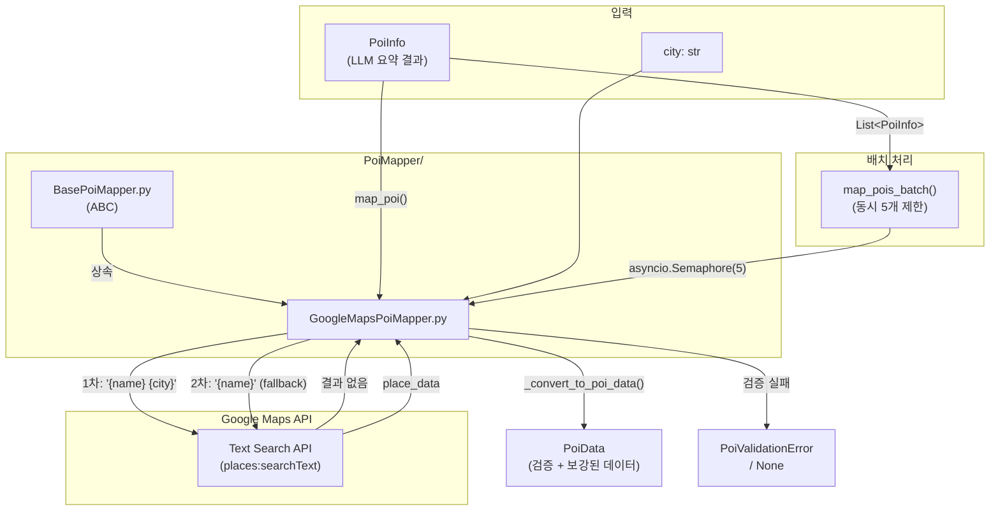

# PoiMapper

## 📁 개요

이 폴더는 **POI 데이터를 외부 API를 통해 검증하고 보강**하는 매퍼 모듈들을 포함합니다. 웹 검색으로 수집된 POI 정보를 Google Maps Places API로 검증하여 실제 존재하는 장소인지 확인하고, 위치 좌표, 영업시간, 평점 등의 상세 정보로 보강합니다.

---

## 📄 파일 목록

### `BasePoiMapper.py`

#### 📝 파일 설명

POI 매핑을 위한 **추상 기본 클래스(Abstract Base Class)**를 정의합니다. 모든 POI 매퍼는 이 클래스를 상속받아 구현해야 합니다.

---

#### 🏗️ 클래스: `BasePoiMapper`

**설명**: POI 매핑의 추상 기본 클래스입니다. `ABC`를 상속받아 구현되었습니다.

##### 🔧 메서드 (Methods)

**`map_poi(poi_info: PoiInfo, city: str) -> Optional[PoiData]`** *(추상 메서드, 비동기)*

- **설명**: 단일 POI 정보를 검증하고 PoiData로 매핑합니다.
- **파라미터**:
  - `poi_info` (`PoiInfo`): 변환할 POI 정보
  - `city` (`str`): 검색 컨텍스트로 사용할 도시명
- **반환값**: `Optional[PoiData]` - 검증 성공 시 PoiData, 실패 시 None

---

**`map_pois_batch(poi_infos: List[PoiInfo], city: str) -> List[PoiData]`** *(추상 메서드, 비동기)*

- **설명**: 여러 POI를 배치로 매핑합니다.
- **파라미터**:
  - `poi_infos` (`List[PoiInfo]`): 변환할 POI 정보 리스트
  - `city` (`str`): 검색 컨텍스트로 사용할 도시명
- **반환값**: `List[PoiData]` - 검증에 성공한 PoiData 리스트

---

### `GoogleMapsPoiMapper.py`

#### 📝 파일 설명

`BasePoiMapper`를 상속받아 **Google Maps Places API (New)를 사용한 POI 검증 및 매핑**을 구현한 클래스입니다. Text Search API를 통해 POI를 검증하고 실제 장소 정보로 보강합니다.

---

#### 🏗️ 클래스: `GoogleMapsPoiMapper`

**설명**: Google Maps Places API를 사용하여 POI를 검증하고 상세 정보로 보강하는 매퍼입니다.

##### 📌 상수 (Constants)

| 상수명 | 값 | 설명 |
|--------|-----|------|
| `BASE_URL` | `https://places.googleapis.com/v1/places:searchText` | Places API 엔드포인트 |
| `FIELD_MASK` | (다수 필드) | 요청할 Places API 필드 목록 |

##### 📌 필드 (Attributes)

| 필드명 | 타입 | 설명 |
|--------|------|------|
| `api_key` | `str` | Google Maps API 키 (config에서 로드) |

##### 🔧 메서드 (Methods)

**`generate_poi_id(url: str) -> str`** *(정적 메서드)*

- **설명**: URL의 MD5 해시를 생성하여 poi_id로 사용합니다.
- **파라미터**:
  - `url` (`str`): POI 원본 URL
- **반환값**: `str` - 32자리 MD5 해시 문자열
- **사용 목적**: 동일 URL에서 수집된 POI는 항상 같은 poi_id를 가짐 (중복 방지)

```python
# 사용 예시
poi_id = GoogleMapsPoiMapper.generate_poi_id("https://example.com/poi/123")
# 결과: "49758e0942d78fcfa0640df92c1a85cc"
```

---

**`map_poi(poi_info: PoiInfo, city: str, source_url: Optional[str] = None, raise_on_failure: bool = False) -> Optional[PoiData]`** *(비동기)*

- **설명**: 단일 POI를 Google Maps로 검증 및 매핑합니다.
- **파라미터**:
  - `poi_info` (`PoiInfo`): 검증할 POI 정보
  - `city` (`str`): 검색 컨텍스트 도시명
  - `source_url` (`Optional[str]`): POI 원본 URL (poi_id 생성에 사용)
  - `raise_on_failure` (`bool`, 기본값: `False`): True이면 검증 실패 시 `PoiValidationError` 발생
- **반환값**: `Optional[PoiData]` - 검증 성공 시 PoiData, 실패 시 None
- **예외**: `PoiValidationError` - `raise_on_failure=True`이고 검증 실패 시
- **Fallback 검색**: `"{poi_info.name} {city}"` 검색 실패 시 `"{poi_info.name}"` 만으로 재검색합니다.

---

**`map_pois_batch(poi_infos: List[PoiInfo], city: str) -> List[PoiData]`** *(비동기)*

- **설명**: 여러 POI를 배치로 매핑합니다. 동시 최대 5개 요청으로 rate limit을 관리합니다.
- **파라미터**:
  - `poi_infos` (`List[PoiInfo]`): POI 정보 리스트
  - `city` (`str`): 검색 컨텍스트 도시명
- **반환값**: `List[PoiData]` - 검증 성공한 PoiData 리스트

---

##### 내부 메서드

| 메서드 | 설명 |
|--------|------|
| `_search_place(query: str)` | Google Places Text Search API 호출 |
| `_convert_to_poi_data(poi_info, place_data, city, source_url)` | API 응답을 PoiData로 변환 |
| `_map_category(primary_type, types)` | Google 타입을 PoiCategory로 매핑 |
| `_parse_opening_hours(hours_data)` | 영업시간을 OpeningHours 모델로 변환 |
| `_parse_price_range(price_range_data)` | 가격 범위 파싱 |
| `_build_raw_text(poi_info, place_data)` | 임베딩용 텍스트 생성 |

---

## 🚨 예외 클래스

### `PoiValidationError`

**위치**: `app.core.models.PoiAgentDataclass.poi`

**설명**: POI를 외부 API로 검증할 수 없을 때 발생하는 예외입니다.

**발생 조건**:
- Google Maps API에서 장소를 찾을 수 없음
- API 키가 설정되지 않음
- API 호출 중 오류 발생

**사용 예시**:
```python
from app.core.models.PoiAgentDataclass.poi import PoiValidationError

try:
    poi_data = await mapper.map_poi(poi_info, city, source_url, raise_on_failure=True)
except PoiValidationError as e:
    logger.warning(f"POI 검증 실패: {e}")
    # 건너뛰고 계속 진행
```

---

## 🔗 의존성

### 외부 라이브러리
- `httpx`: 비동기 HTTP 클라이언트
- `hashlib`: MD5 해시 생성 (표준 라이브러리)

### 내부 모듈
- `app.core.models.PoiAgentDataclass.poi`: 데이터 모델 (`PoiInfo`, `PoiData`, `PoiValidationError`)
- `app.core.config`: 설정 (`google_maps_api_key`)

---

## 📊 Google Maps API 필드

`GoogleMapsPoiMapper`가 요청하는 Places API 필드:

| 필드 | 설명 | SKU |
|------|------|-----|
| `places.id` | Google Place ID | Basic |
| `places.displayName` | 표시 이름 | Basic |
| `places.formattedAddress` | 포맷된 주소 | Basic |
| `places.location` | 위도/경도 | Basic |
| `places.types` | 장소 유형 목록 | Basic |
| `places.primaryType` | 주요 유형 | Basic |
| `places.googleMapsUri` | Google Maps 링크 | Basic |
| `places.rating` | 평점 | Pro |
| `places.userRatingCount` | 리뷰 수 | Pro |
| `places.priceLevel` | 가격대 | Pro |
| `places.priceRange` | 가격 범위 | Enterprise |
| `places.websiteUri` | 웹사이트 | Pro |
| `places.internationalPhoneNumber` | 전화번호 | Pro |
| `places.regularOpeningHours` | 영업시간 | Pro |

---

## 📊 파일 흐름 다이어그램



---

## 📝 변경 이력

### 2026-01-31
- `map_poi()` Fallback 검색 추가: `"{name} {city}"` 실패 시 `"{name}"` 만으로 재검색

### 2026-01-29
- `generate_poi_id(url: str)` 정적 메서드 추가: URL 기반 MD5 해시 poi_id 생성
- `map_poi()`에 `source_url`, `raise_on_failure` 파라미터 추가
- `PoiValidationError` 예외 지원 추가
- `_convert_to_poi_data()`에 `source_url` 파라미터 추가
