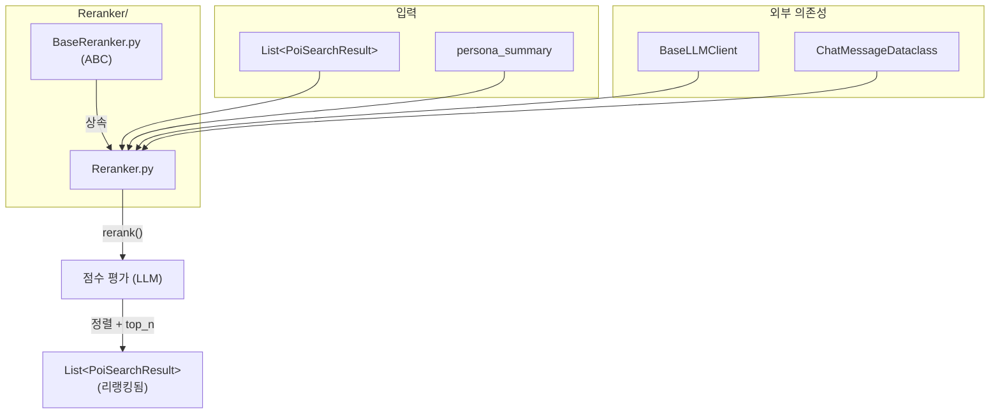

# Reranker

## 📁 개요

검색 결과를 **페르소나 기반으로 리랭킹**하는 모듈입니다. LLM을 사용하여 각 검색 결과가 사용자 페르소나(취향, 예산, 여행 스타일)와 얼마나 관련있는지 점수를 매기고 순서를 재정렬합니다.

---

## 📄 파일

### `BaseReranker.py`

리랭킹 에이전트의 **추상 기본 클래스(Abstract Base Class)**를 정의합니다.

#### 🏗️ 클래스: `BaseReranker(ABC)`

**설명**: 리랭킹 에이전트가 구현해야 하는 인터페이스를 정의하는 추상 클래스입니다.

##### 🔧 메서드 (Methods)

**`rerank(results: List[PoiSearchResult], persona_summary: str) -> List[PoiSearchResult]`** *(추상, 비동기)*

- **설명**: 검색 결과를 페르소나 기반으로 리랭킹합니다.

**`rerank_batch(web_results, embedding_results, persona_summary) -> tuple[List[PoiSearchResult], List[PoiSearchResult]]`** *(추상, 비동기)*

- **설명**: 웹 검색 결과와 임베딩 검색 결과를 동시에 리랭킹합니다.

---

### `Reranker.py`

---

### 🔧 상수

| 이름 | 타입 | 설명 |
|------|------|------|
| `RERANK_PROMPT` | `str` | LLM에게 관련도 점수 평가를 요청하는 프롬프트 템플릿 |

**평가 기준**:
- 페르소나의 취향, 예산, 여행 스타일과 얼마나 맞는지
- 높은 점수일수록 해당 여행자에게 적합

---

### 🏗️ 클래스: `Reranker`

**설명**: 검색 결과를 페르소나 기반으로 리랭킹하는 모듈입니다.

#### 📌 필드 (Attributes)

| 필드명 | 타입 | 설명 |
|--------|------|------|
| `llm` | `BaseLLMClient` | LLM 클라이언트 인스턴스 |
| `top_n` | `int` | 리랭킹 후 반환할 상위 결과 수 (기본값: `10`) |

#### 🔧 메서드 (Methods)

**`__init__(llm_client: BaseLLMClient, top_n: int = 10)`**

- **설명**: Reranker 인스턴스를 생성합니다.
- **파라미터**:
  - `llm_client` (`BaseLLMClient`): LLM 클라이언트
  - `top_n` (`int`, 기본값: `10`): 반환할 상위 결과 수

---

**`rerank(results: List[PoiSearchResult], persona_summary: str) -> List[PoiSearchResult]`** *(비동기)*

- **설명**: 검색 결과를 페르소나 기반으로 리랭킹합니다.
- **파라미터**:
  - `results` (`List[PoiSearchResult]`): 검색 결과 리스트
  - `persona_summary` (`str`): 여행자 페르소나 요약
- **반환값**: `List[PoiSearchResult]` - 리랭킹된 상위 n개 결과
- **동작 방식**:
  1. 결과가 `top_n` 이하면 그대로 반환
  2. LLM으로 각 결과의 관련도 점수(0.0~1.0) 평가
  3. 점수순 정렬 후 상위 n개 반환
- **예외 처리**: 오류 시 원본 상위 n개 반환

---

**`_format_results(results: List[PoiSearchResult]) -> str`** *(내부 메서드)*

- **설명**: 검색 결과를 LLM 입력용 XML 형식으로 변환합니다.

---

**`_parse_scores(response: str, count: int) -> List[float]`** *(내부 메서드)*

- **설명**: LLM 응답에서 점수를 파싱합니다.
- **반환값**: `List[float]` - 점수 리스트 (0.0~1.0 범위로 클램핑)

---

## 📊 파일 흐름 다이어그램

---

## 🔗 의존성

- `app.core.LLMClient.BaseLlmClient`: LLM 추상 클래스
- `app.core.models.PoiAgentDataclass.poi`: `PoiSearchResult` 데이터 모델
- `app.core.models.LlmClientDataclass.ChatMessageDataclass`: 메시지 데이터 모델
