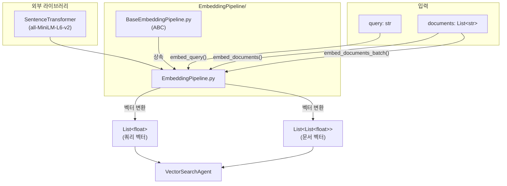

# EmbeddingPipeline

## 📁 개요

**자연어 텍스트를 임베딩 벡터로 변환하는 파이프라인**입니다. sentence-transformers를 사용하여 텍스트를 고차원 벡터로 인코딩합니다.

---

## 📄 파일

### `BaseEmbeddingPipeline.py`

임베딩 파이프라인의 **추상 기본 클래스(Abstract Base Class)**를 정의합니다.

#### 🏗️ 클래스: `BaseEmbeddingPipeline(ABC)`

**설명**: 자연어 → 임베딩 벡터 변환을 담당하는 추상 클래스입니다.

##### 🔧 메서드 (Methods)

**`embed_query(query: str) -> List[float]`** *(추상, 비동기)*

- **설명**: 쿼리 텍스트를 임베딩 벡터로 변환합니다.

**`embed_documents(documents: List[str]) -> List[List[float]]`** *(추상, 비동기)*

- **설명**: 문서 텍스트 리스트를 임베딩 벡터 리스트로 변환합니다.

**`embed_documents_batch(documents: List[str], batch_size: int = 100) -> List[List[float]]`** *(추상, 비동기)*

- **설명**: 대량의 문서를 배치 단위로 나누어 임베딩 변환합니다.

---

### `EmbeddingPipeline.py`

---

### 🏗️ 클래스: `EmbeddingPipeline`

**설명**: sentence-transformers 기반 임베딩 변환 파이프라인입니다.

#### 📌 필드 (Attributes)

| 필드명 | 타입 | 설명 |
|--------|------|------|
| `_model` | `SentenceTransformer` | 임베딩 모델 인스턴스 |

#### 🔧 메서드 (Methods)

**`__init__(model_name: str = "all-MiniLM-L6-v2")`**

- **설명**: EmbeddingPipeline 인스턴스를 생성합니다.
- **파라미터**:
  - `model_name` (`str`, 기본값: `"all-MiniLM-L6-v2"`): 사용할 sentence-transformers 모델 이름

---

**`embed_query(query: str) -> List[float]`** *(비동기)*

- **설명**: 단일 쿼리 텍스트를 임베딩 벡터로 변환합니다.
- **파라미터**:
  - `query` (`str`): 변환할 쿼리 텍스트
- **반환값**: `List[float]` - 임베딩 벡터

---

**`embed_documents(documents: List[str]) -> List[List[float]]`** *(비동기)*

- **설명**: 문서 텍스트 리스트를 임베딩 벡터 리스트로 변환합니다.
- **파라미터**:
  - `documents` (`List[str]`): 변환할 문서 텍스트 리스트
- **반환값**: `List[List[float]]` - 임베딩 벡터 리스트

---

**`embed_documents_batch(documents: List[str], batch_size: int = 100) -> List[List[float]]`** *(비동기)*

- **설명**: 대량의 문서를 배치 단위로 나누어 임베딩 변환합니다. 메모리 효율적인 처리가 필요할 때 사용합니다.
- **파라미터**:
  - `documents` (`List[str]`): 변환할 문서 텍스트 리스트
  - `batch_size` (`int`, 기본값: `100`): 한 번에 처리할 문서 수
- **반환값**: `List[List[float]]` - 임베딩 벡터 리스트
- **사용 예시**:
  ```python
  pipeline = EmbeddingPipeline()
  embeddings = await pipeline.embed_documents_batch(documents, batch_size=50)
  ```

---

## 📊 파일 흐름 다이어그램



---

## 🔗 의존성

- `sentence-transformers`: 임베딩 모델
- `app.core.Agents.Poi.VectorDB.EmbeddingPipeline.BaseEmbeddingPipeline`: 추상 기본 클래스
