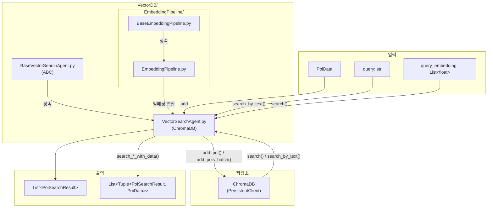

# VectorDB

## 📁 개요

이 폴더는 **POI(Point of Interest) 데이터를 벡터 임베딩으로 저장하고 유사도 기반 검색을 수행**하는 에이전트들을 포함합니다. Two-tower 아키텍처의 POI Tower 역할을 담당하며, ChromaDB를 기반으로 벡터 저장 및 검색 기능을 제공합니다.

---

## 📄 파일 목록

### `BaseVectorSearchAgent.py`

#### 📝 파일 설명

벡터 검색 에이전트의 **추상 기본 클래스(Abstract Base Class)**를 정의합니다. 모든 벡터 검색 에이전트는 이 클래스를 상속받아 구현해야 합니다. Two-tower 아키텍처에서 POI Tower의 인터페이스 역할을 합니다.

---

#### 🏗️ 클래스: `BaseVectorSearchAgent`

**설명**: 벡터 검색 에이전트의 추상 기본 클래스입니다. `ABC`를 상속받아 구현되었으며, 하위 클래스에서 반드시 구현해야 하는 메서드들을 정의합니다.

##### 📌 필드 (Attributes)

> 이 클래스는 추상 클래스로, 인스턴스 필드를 정의하지 않습니다.

##### 🔧 메서드 (Methods)

**`search(query_embedding: List[float], k: int = 10) -> List[PoiSearchResult]`** *(추상 메서드)*

- **설명**: 쿼리 임베딩 벡터를 사용하여 벡터 유사도 검색을 수행합니다.
- **파라미터**:
  - `query_embedding` (`List[float]`): 검색에 사용할 쿼리 임베딩 벡터
  - `k` (`int`, 기본값: `10`): 반환할 검색 결과 수
- **반환값**: `List[PoiSearchResult]` - 유사도가 높은 POI 검색 결과 리스트

---

**`search_by_text(query: str, k: int = 10) -> List[PoiSearchResult]`** *(추상 메서드)*

- **설명**: 텍스트 쿼리로 검색을 수행합니다. 내부적으로 텍스트를 임베딩으로 변환하여 검색합니다.
- **파라미터**:
  - `query` (`str`): 검색할 텍스트 쿼리
  - `k` (`int`, 기본값: `10`): 반환할 검색 결과 수
- **반환값**: `List[PoiSearchResult]` - 유사도가 높은 POI 검색 결과 리스트

---

**`add_poi(poi: PoiData) -> bool`** *(추상 메서드)*

- **설명**: 단일 POI 데이터를 벡터 DB에 추가합니다.
- **파라미터**:
  - `poi` (`PoiData`): 추가할 POI 데이터 객체
- **반환값**: `bool` - 추가 성공 여부

---

**`add_pois_batch(pois: List[PoiData]) -> int`** *(추상 메서드)*

- **설명**: 여러 POI 데이터를 배치로 벡터 DB에 추가합니다.
- **파라미터**:
  - `pois` (`List[PoiData]`): 추가할 POI 데이터 리스트
- **반환값**: `int` - 성공적으로 추가된 POI 개수

---

**`get_collection_size() -> int`** *(추상 메서드)*

- **설명**: 벡터 DB에 저장된 현재 데이터 개수를 반환합니다.
- **파라미터**: 없음
- **반환값**: `int` - 저장된 데이터 개수

---

### `VectorSearchAgent.py`

#### 📝 파일 설명

`BaseVectorSearchAgent`를 상속받아 **ChromaDB 기반의 벡터 검색 기능을 구현**한 클래스입니다. POI 임베딩을 저장하고 검색하며, DB가 비어있어도 에러 없이 빈 결과를 반환하도록 설계되었습니다. 지연 로딩(Lazy Loading) 패턴을 사용하여 필요할 때만 ChromaDB를 초기화합니다.

---

#### 🏗️ 클래스: `VectorSearchAgent`

**설명**: ChromaDB를 사용하여 POI 임베딩을 저장하고 코사인 유사도 기반 검색을 수행하는 에이전트입니다. `BaseVectorSearchAgent`를 상속받아 구현되었습니다.

##### 📌 필드 (Attributes)

| 필드명 | 타입 | 설명 |
|--------|------|------|
| `collection_name` | `str` | ChromaDB 컬렉션 이름 (기본값: `"poi_embeddings"`) |
| `persist_directory` | `Optional[str]` | 데이터를 영구 저장할 디렉토리 경로. `None`이면 메모리에만 저장 |
| `_client` | `chromadb.Client \| None` | ChromaDB 클라이언트 인스턴스 (내부용) |
| `_collection` | `chromadb.Collection \| None` | ChromaDB 컬렉션 인스턴스 (내부용) |
| `_initialized` | `bool` | 초기화 완료 여부 플래그 (내부용) |

##### 🔧 메서드 (Methods)

**`__init__(embedding_pipeline: BaseEmbeddingPipeline, collection_name: str = "poi_embeddings", persist_directory: Optional[str] = None, use_persistent: bool = True)`**

- **설명**: VectorSearchAgent 인스턴스를 생성합니다.
- **파라미터**:
  - `embedding_pipeline` (`BaseEmbeddingPipeline`): 텍스트 임베딩 변환 파이프라인
  - `collection_name` (`str`, 기본값: `"poi_embeddings"`): 사용할 ChromaDB 컬렉션 이름
  - `persist_directory` (`Optional[str]`, 기본값: `None`): 데이터를 영구 저장할 디렉토리
  - `use_persistent` (`bool`, 기본값: `True`): `False`이면 인메모리 모드로 동작

---

**`_initialize() -> bool`** *(내부 메서드)*

- **설명**: ChromaDB 클라이언트와 컬렉션을 초기화합니다. 지연 로딩 패턴을 사용하여 첫 사용 시에만 초기화됩니다.
- **파라미터**: 없음
- **반환값**: `bool` - 초기화 성공 여부
- **동작 방식**:
  1. 이미 초기화된 경우 `True` 반환
  2. `persist_directory`가 설정되면 `PersistentClient`, 아니면 `Client` 생성
  3. `get_or_create_collection`으로 컬렉션 생성/획득 (코사인 거리 사용)
- **예외 처리**:
  - ChromaDB 미설치 시 `ImportError` 처리
  - 기타 초기화 오류 시 `False` 반환

---

**`search(query_embedding: List[float], k: int = 10) -> List[PoiSearchResult]`** *(비동기)*

- **설명**: 임베딩 벡터를 사용하여 벡터 유사도 검색을 수행합니다.
- **파라미터**:
  - `query_embedding` (`List[float]`): 쿼리 임베딩 벡터
  - `k` (`int`, 기본값: `10`): 반환할 결과 수
- **반환값**: `List[PoiSearchResult]` - 검색 결과 리스트. 오류 시 빈 리스트 반환
- **동작 방식**:
  1. ChromaDB 초기화 확인
  2. `query_embeddings`로 유사도 검색 수행
  3. 코사인 거리를 유사도 점수(1 - distance)로 변환
  4. `PoiSearchResult` 객체 리스트 생성 및 반환

---

**`search_by_text(query: str, k: int = 10) -> List[PoiSearchResult]`** *(비동기)*

- **설명**: 텍스트 쿼리로 검색합니다. ChromaDB 내장 임베딩 기능을 사용합니다.
- **파라미터**:
  - `query` (`str`): 검색할 텍스트
  - `k` (`int`, 기본값: `10`): 반환할 결과 수
- **반환값**: `List[PoiSearchResult]` - 검색 결과 리스트. 컬렉션이 비어있거나 오류 시 빈 리스트 반환
- **동작 방식**:
  1. ChromaDB 초기화 확인
  2. 컬렉션이 비어있으면 빈 리스트 반환
  3. `query_texts`로 텍스트 기반 검색 수행
  4. 결과를 `PoiSearchResult` 객체로 변환

---

**`_build_metadata(poi: PoiData) -> dict`** *(정적 메서드)*

- **설명**: PoiData에서 ChromaDB metadata dict를 생성합니다. Google Maps 필드, 영업시간 등 **전체 필드**를 포함합니다.
- **저장되는 메타데이터**:
  - 기본: `name`, `category`, `description`, `city`, `address`, `source`, `source_url`
  - Google Maps: `google_place_id`, `latitude`, `longitude`, `google_maps_uri`, `types`, `primary_type`
  - 상세: `google_rating`, `user_rating_count`, `price_level`, `price_range`, `website_uri`, `phone_number`
  - 영업시간: `opening_hours` (JSON 직렬화)

---

**`_reconstruct_poi_data(doc_id: str, metadata: dict, document: str) -> PoiData`** *(정적 메서드)*

- **설명**: ChromaDB metadata에서 PoiData 객체를 재구성합니다.
- **파라미터**:
  - `doc_id` (`str`): ChromaDB 문서 ID (= poi_id)
  - `metadata` (`dict`): ChromaDB metadata
  - `document` (`str`): 저장된 raw_text
- **반환값**: `PoiData` - 재구성된 POI 데이터

---

**`add_poi(poi: PoiData) -> bool`** *(비동기)*

- **설명**: 단일 POI 데이터를 벡터 DB에 추가합니다. `_build_metadata()`를 사용하여 전체 필드를 metadata에 저장합니다.
- **파라미터**:
  - `poi` (`PoiData`): 추가할 POI 데이터
- **반환값**: `bool` - 추가 성공 여부

---

**`add_pois_batch(pois: List[PoiData]) -> int`** *(비동기)*

- **설명**: 여러 POI 데이터를 배치로 추가합니다. **중복 ID를 자동으로 필터링**합니다.
- **파라미터**:
  - `pois` (`List[PoiData]`): 추가할 POI 데이터 리스트
- **반환값**: `int` - 성공적으로 추가된 POI 개수. 빈 리스트나 오류 시 `0` 반환
- **중복 제거 로직**:
  1. 배치 내 중복 ID 제거 (첫 번째 항목 유지)
  2. `collection.get(ids=...)`로 컬렉션에 이미 존재하는 ID 필터링
  3. 새로운 POI만 추가

---

**`search_with_data(query_embedding, k, city_filter) -> List[Tuple[PoiSearchResult, PoiData]]`** *(비동기)*

- **설명**: 임베딩 벡터로 유사도 검색을 수행하고, metadata에서 `PoiData`를 복원하여 함께 반환합니다.
- **반환값**: `List[Tuple[PoiSearchResult, PoiData]]` - 검색 결과와 복원된 PoiData의 쌍

---

**`search_by_text_with_data(query, k, city_filter) -> List[Tuple[PoiSearchResult, PoiData]]`** *(비동기)*

- **설명**: 텍스트 쿼리로 검색하고, metadata에서 `PoiData`를 복원하여 함께 반환합니다. `PoiGraph._embedding_search`에서 사용됩니다.
- **반환값**: `List[Tuple[PoiSearchResult, PoiData]]` - 검색 결과와 복원된 PoiData의 쌍

---

**`get_collection_size() -> int`** *(비동기)*

- **설명**: 벡터 DB에 저장된 현재 데이터 개수를 반환합니다.
- **파라미터**: 없음
- **반환값**: `int` - 저장된 데이터 개수. 초기화 실패 또는 오류 시 `0` 반환

---

## 📊 파일 흐름 다이어그램

---

## 🔗 의존성

- `chromadb`: 벡터 데이터베이스
- `json`: metadata 직렬화/역직렬화 (types, opening_hours)
- `app.core.models.PoiAgentDataclass.poi`: `PoiSearchResult`, `PoiData`, `PoiCategory`, `PoiSource`, `OpeningHours` 데이터클래스
