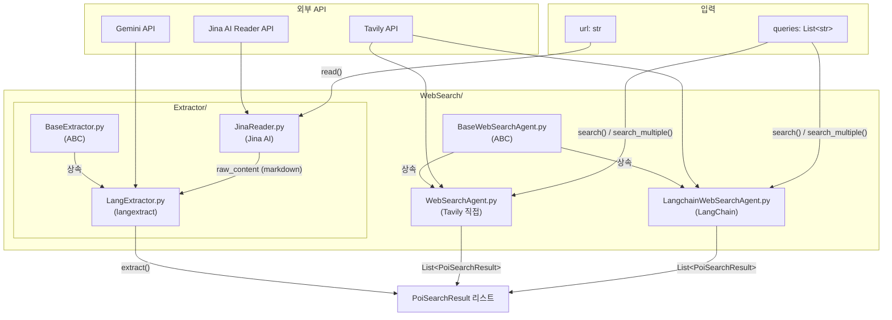

# WebSearch

## 📁 개요

이 폴더는 **웹 검색을 통해 POI(Point of Interest) 정보를 수집**하는 에이전트들을 포함합니다. Tavily API를 사용하여 웹에서 POI 관련 정보를 검색하며, 직접 API 호출 방식과 LangChain 기반 방식 두 가지 구현을 제공합니다.

---

## 📄 파일 목록

### `BaseWebSearchAgent.py`

#### 📝 파일 설명

웹 검색 에이전트의 **추상 기본 클래스(Abstract Base Class)**를 정의합니다. 모든 웹 검색 에이전트는 이 클래스를 상속받아 구현해야 합니다.

---

#### 🏗️ 클래스: `BaseWebSearchAgent`

**설명**: 웹 검색 에이전트의 추상 기본 클래스입니다. `ABC`를 상속받아 구현되었으며, 하위 클래스에서 반드시 구현해야 하는 메서드들을 정의합니다.

##### 📌 필드 (Attributes)

> 이 클래스는 추상 클래스로, 인스턴스 필드를 정의하지 않습니다.

##### 🔧 메서드 (Methods)

**`search(query: str, num_results: int = 10) -> List[PoiSearchResult]`** *(추상 메서드)*

- **설명**: 단일 쿼리로 웹 검색을 실행합니다.
- **파라미터**:
  - `query` (`str`): 검색할 쿼리 문자열
  - `num_results` (`int`, 기본값: `10`): 반환할 검색 결과 수
- **반환값**: `List[PoiSearchResult]` - 검색 결과 리스트

---

**`search_multiple(queries: List[str], num_results_per_query: int = 5) -> List[PoiSearchResult]`** *(추상 메서드)*

- **설명**: 여러 쿼리로 검색을 수행한 후 결과를 병합합니다.
- **파라미터**:
  - `queries` (`List[str]`): 검색할 쿼리 리스트
  - `num_results_per_query` (`int`, 기본값: `5`): 각 쿼리당 반환할 결과 수
- **반환값**: `List[PoiSearchResult]` - 병합된 검색 결과 리스트

---

### `WebSearchAgent.py`

#### 📝 파일 설명

`BaseWebSearchAgent`를 상속받아 **Tavily API를 직접 호출하여 웹 검색을 수행**하는 클래스입니다. `TavilyClient`를 사용하여 동기 방식으로 API를 호출하며, 검색 실패 시에도 전체 흐름이 중단되지 않도록 빈 결과를 반환합니다.

---

#### 🏗️ 클래스: `WebSearchAgent`

**설명**: Tavily API를 사용하여 POI 정보를 검색하는 웹 검색 에이전트입니다. 다른 API로 교체 시 이 클래스만 수정하면 됩니다.

##### 📌 필드 (Attributes)

| 필드명 | 타입 | 설명 |
|--------|------|------|
| `api_key` | `Optional[str]` | Tavily API 키. 생성자에서 전달받거나 `settings`에서 가져옴 |
| `base_url` | `str` | Tavily API 기본 URL (기본값: `"https://api.tavily.com"`) |
| `client` | `TavilyClient` | Tavily API 클라이언트 인스턴스 |

##### 🔧 메서드 (Methods)

**`__init__(api_key: Optional[str] = None, base_url: str = "https://api.tavily.com")`**

- **설명**: WebSearchAgent 인스턴스를 생성합니다.
- **파라미터**:
  - `api_key` (`Optional[str]`, 기본값: `None`): Tavily API 키. `None`이면 `settings.tavily_api_key`에서 가져옴
  - `base_url` (`str`, 기본값: `"https://api.tavily.com"`): Tavily API의 기본 URL

---

**`search(query: str, num_results: int = 10) -> List[PoiSearchResult]`** *(비동기)*

- **설명**: 단일 쿼리로 웹 검색을 실행합니다.
- **파라미터**:
  - `query` (`str`): 검색할 쿼리
  - `num_results` (`int`, 기본값: `10`): 반환할 결과 수
- **반환값**: `List[PoiSearchResult]` - 검색 결과 리스트. API 키가 없거나 오류 시 빈 리스트 반환
- **동작 방식**:
  1. API 키 유무 확인 (없으면 빈 리스트 반환)
  2. `TavilyClient.search()` 호출 (`search_depth="basic"`)
  3. 응답을 `PoiSearchResult` 객체로 변환

---

**`search_multiple(queries: List[str], num_results_per_query: int = 5) -> List[PoiSearchResult]`** *(비동기)*

- **설명**: 여러 쿼리로 병렬 검색을 수행하고 결과를 병합합니다.
- **파라미터**:
  - `queries` (`List[str]`): 검색할 쿼리 리스트
  - `num_results_per_query` (`int`, 기본값: `5`): 쿼리당 결과 수
- **반환값**: `List[PoiSearchResult]` - 병합 및 중복 제거된 결과 리스트
- **동작 방식**:
  1. `asyncio.gather()`로 모든 쿼리 병렬 검색
  2. URL 기준으로 중복 제거
  3. `relevance_score` 기준 내림차순 정렬

---

### `LangchainWebSearchAgent.py`

#### 📝 파일 설명

`BaseWebSearchAgent`를 상속받아 **LangChain의 TavilySearch Tool을 사용하여 웹 검색을 수행**하는 클래스입니다. LangChain 생태계와의 통합을 위해 설계되었습니다.

---

#### 🏗️ 클래스: `LangchainWebSearchAgent`

**설명**: LangChain 기반 웹 검색 에이전트입니다. `langchain_tavily`의 `TavilySearch` Tool을 사용하여 POI 정보를 검색합니다.

##### 📌 필드 (Attributes)

| 필드명 | 타입 | 설명 |
|--------|------|------|
| `max_results` | `int` | 기본 최대 결과 수 (기본값: `10`) |
| `api_key` | `str` | Tavily API 키. `settings.tavily_api_key`에서 가져옴 |
| `tool` | `TavilySearch` | LangChain TavilySearch Tool 인스턴스 |

##### 🔧 메서드 (Methods)

**`__init__(max_results: int = 10)`**

- **설명**: LangchainWebSearchAgent 인스턴스를 생성합니다.
- **파라미터**:
  - `max_results` (`int`, 기본값: `10`): 기본 최대 결과 수
- **동작 방식**:
  1. `settings.tavily_api_key`에서 API 키 로드
  2. API 키를 환경변수 `TAVILY_API_KEY`에 설정
  3. `TavilySearch` Tool 인스턴스 생성

---

**`search(query: str, num_results: int = 10) -> List[PoiSearchResult]`** *(비동기)*

- **설명**: 단일 쿼리로 웹 검색을 실행합니다.
- **파라미터**:
  - `query` (`str`): 검색할 쿼리
  - `num_results` (`int`, 기본값: `10`): 반환할 결과 수
- **반환값**: `List[PoiSearchResult]` - 검색 결과 리스트. 오류 시 빈 리스트 반환
- **동작 방식**:
  1. `num_results`가 기본값과 다르면 새 Tool 인스턴스 생성
  2. `tool.ainvoke(query)`로 비동기 검색 실행
  3. 결과를 `PoiSearchResult` 객체로 변환

---

**`search_multiple(queries: List[str], num_results_per_query: int = 5) -> List[PoiSearchResult]`** *(비동기)*

- **설명**: 여러 쿼리로 병렬 검색을 수행하고 결과를 병합합니다.
- **파라미터**:
  - `queries` (`List[str]`): 검색할 쿼리 리스트
  - `num_results_per_query` (`int`, 기본값: `5`): 쿼리당 결과 수
- **반환값**: `List[PoiSearchResult]` - 병합 및 중복 제거된 결과 리스트
- **동작 방식**:
  1. `asyncio.gather()`로 모든 쿼리 병렬 검색
  2. URL 기준으로 중복 제거
  3. `relevance_score` 기준 내림차순 정렬

---

---

## 📂 하위 폴더

### `Extractor/`

웹 검색 결과의 `raw_content`에서 개별 POI 정보를 추출하는 모듈입니다.

#### `BaseExtractor.py`

POI 추출 에이전트의 **추상 기본 클래스**입니다.

**`extract(raw_content: str, url: str = None) -> List[PoiSearchResult]`** *(추상)*

- **설명**: 마크다운 raw_content에서 POI 정보를 추출하여 PoiSearchResult 리스트로 반환합니다.

#### `LangExtractor.py`

`BaseExtractor`를 구현한 **langextract 기반 POI 추출기**입니다. Google의 `langextract` 라이브러리를 활용하여 마크다운 텍스트에서 장소(POI) 정보를 구조적으로 추출합니다.

- **모델**: `gemini-2.5-flash` (기본값)
- **Few-shot 예시**: 일본 라멘집 리뷰에서 POI를 추출하는 예시가 포함되어 있습니다.

#### `JinaReader.py`

**Jina AI Reader**를 사용하여 URL에서 마크다운 텍스트를 추출하는 클라이언트입니다.

- **엔드포인트**: `https://r.jina.ai/{url}`
- **특수 처리**: `blog.naver.com` URL에 대해 `X-With-Iframe` 헤더를 추가합니다.

---

## 🔗 의존성

- `tavily`: Tavily Python 클라이언트 (WebSearchAgent용)
- `langchain_tavily`: LangChain Tavily 통합 (LangchainWebSearchAgent용)
- `langextract`: POI 추출 (LangExtractor용)
- `httpx`: HTTP 클라이언트
- `asyncio`: 비동기 처리
- `app.core.config.settings`: API 키 설정
- `app.core.models.PoiAgentDataclass.poi`: `PoiSearchResult`, `PoiSource` 데이터클래스

---

## 📊 파일 흐름 다이어그램

---

## 🔄 WebSearchAgent vs LangchainWebSearchAgent

| 특성 | WebSearchAgent | LangchainWebSearchAgent |
|------|----------------|-------------------------|
| 라이브러리 | `tavily` (공식 클라이언트) | `langchain_tavily` |
| API 호출 방식 | 동기 (`client.search()`) | 비동기 (`tool.ainvoke()`) |
| 검색 깊이 설정 | `search_depth="basic"` 고정 | Tool 기본 설정 사용 |
| 사용 시나리오 | 독립 사용 | LangChain 파이프라인 통합 |
