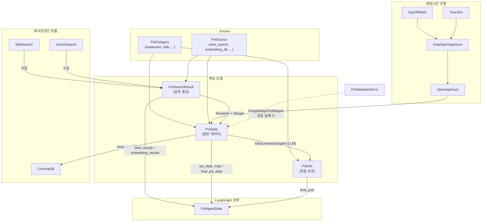

# PoiAgentDataclass

## 📁 개요

이 폴더는 **POI(Point of Interest) 에이전트에서 사용하는 모든 데이터 모델**을 정의합니다. POI 검색, 저장, 추천 파이프라인 전반에서 사용되는 핵심 데이터 구조들을 포함합니다.

---

## 📄 파일 목록

### `__init__.py`

#### 📝 파일 설명

패키지의 공개 API를 정의합니다. `poi.py`에서 정의된 모든 클래스를 외부에 노출합니다.

##### 📤 내보내기 (Exports)

```python
from app.core.models.PoiAgentDataclass import (
    PoiCategory,
    PoiSource,
    PoiData,
    PoiSearchResult,
    PoiInfo,
    PoiAgentState,
)
```

---

### `poi.py`

#### 📝 파일 설명

POI 에이전트의 **핵심 데이터 모델**을 정의합니다. Enum 타입, Pydantic 모델, TypedDict를 사용하여 타입 안전성을 보장합니다.

---

#### 🔢 Enum: `PoiCategory`

**설명**: POI의 카테고리를 정의하는 열거형입니다.

| 값 | 문자열 | 설명 |
|----|--------|------|
| `RESTAURANT` | `"restaurant"` | 음식점 |
| `CAFE` | `"cafe"` | 카페 |
| `ATTRACTION` | `"attraction"` | 관광지 |
| `ACCOMMODATION` | `"accommodation"` | 숙박시설 |
| `SHOPPING` | `"shopping"` | 쇼핑 |
| `ENTERTAINMENT` | `"entertainment"` | 엔터테인먼트 |
| `OTHER` | `"other"` | 기타 |

##### 💡 사용 예시

```python
category = PoiCategory.RESTAURANT
print(category.value)  # "restaurant"
```

---

#### 🔢 Enum: `PoiSource`

**설명**: POI 데이터의 출처를 정의하는 열거형입니다.

| 값 | 문자열 | 설명 |
|----|--------|------|
| `WEB_SEARCH` | `"web_search"` | 웹 검색으로 수집 |
| `EMBEDDING_DB` | `"embedding_db"` | 벡터 DB에서 검색 |
| `USER_FEEDBACK` | `"user_feedback"` | 사용자 피드백으로 추가 |

---

#### 🏗️ 클래스: `PoiData`

**설명**: 수집된 POI의 원본 데이터를 저장하는 모델입니다. 벡터 DB에 저장되는 데이터 형식입니다.

##### 📌 필드 (Attributes)

| 필드명 | 타입 | 필수 | 기본값 | 설명 |
|--------|------|------|--------|------|
| `id` | `str` | ✅ | - | POI 고유 ID (UUID) |
| `name` | `str` | ✅ | - | POI 이름 |
| `category` | `PoiCategory` | ❌ | `PoiCategory.OTHER` | POI 카테고리 |
| `description` | `str` | ❌ | `""` | POI 설명 |
| `city` | `Optional[str]` | ❌ | `None` | 도시명 |
| `address` | `Optional[str]` | ❌ | `None` | 주소 |
| `source` | `PoiSource` | ✅ | - | 데이터 출처 |
| `source_url` | `Optional[str]` | ❌ | `None` | 출처 URL |
| `raw_text` | `str` | ✅ | - | 임베딩 생성용 원본 텍스트 |
| `created_at` | `datetime` | ❌ | `datetime.now()` | 생성 시간 |
| `google_place_id` | `Optional[str]` | ❌ | `None` | Google Place ID |
| `latitude` | `Optional[float]` | ❌ | `None` | 위도 |
| `longitude` | `Optional[float]` | ❌ | `None` | 경도 |
| `google_maps_uri` | `Optional[str]` | ❌ | `None` | Google Maps 링크 |
| `types` | `Optional[List[str]]` | ❌ | `None` | Google 장소 유형 목록 |
| `primary_type` | `Optional[str]` | ❌ | `None` | 주요 장소 유형 |
| `google_rating` | `Optional[float]` | ❌ | `None` | Google 평점 |
| `user_rating_count` | `Optional[int]` | ❌ | `None` | 리뷰 수 |
| `price_level` | `Optional[str]` | ❌ | `None` | 가격대 |
| `price_range` | `Optional[str]` | ❌ | `None` | 가격 범위 |
| `website_uri` | `Optional[str]` | ❌ | `None` | 웹사이트 |
| `phone_number` | `Optional[str]` | ❌ | `None` | 전화번호 |
| `opening_hours` | `Optional[OpeningHours]` | ❌ | `None` | 영업시간 |

##### 💡 사용 예시

```python
poi = PoiData(
    id="uuid-1234",
    name="을지로 골뱅이집",
    category=PoiCategory.RESTAURANT,
    description="40년 전통 골뱅이 맛집",
    source=PoiSource.WEB_SEARCH,
    raw_text="을지로 골뱅이집. 40년 전통 골뱅이 맛집. 위치: 을지로 3가"
)
```

---

#### 🏗️ 클래스: `PoiSearchResult`

**설명**: 웹 검색 또는 임베딩 검색의 결과를 저장하는 모델입니다.

##### 📌 필드 (Attributes)

| 필드명 | 타입 | 필수 | 기본값 | 설명 |
|--------|------|------|--------|------|
| `poi_id` | `Optional[str]` | ❌ | `None` | POI ID (임베딩 검색 시 존재) |
| `title` | `str` | ✅ | - | 검색 결과 제목 |
| `snippet` | `str` | ✅ | - | 요약 텍스트 |
| `url` | `Optional[str]` | ❌ | `None` | 출처 URL |
| `source` | `PoiSource` | ✅ | - | 검색 출처 |
| `relevance_score` | `float` | ❌ | `0.0` | 관련도 점수 (0.0 ~ 1.0) |

##### 💡 사용 예시

```python
result = PoiSearchResult(
    title="서울 을지로 맛집 베스트 10",
    snippet="을지로에서 꼭 가봐야 할 맛집을 소개합니다...",
    url="https://example.com/article",
    source=PoiSource.WEB_SEARCH,
    relevance_score=0.85
)
```

---

#### 🏗️ 영업시간 모델

**`DayOfWeek(int, Enum)`**: 요일 (1=월 ~ 7=일, ISO 8601)

**`TimeSlot(BaseModel)`**: 하나의 영업 시간대
- `open_time` (`time`): 오픈 시간
- `close_time` (`time`): 마감 시간

**`DailyOpeningHours(BaseModel)`**: 하루 영업시간
- `day` (`DayOfWeek`): 요일
- `slots` (`List[TimeSlot]`): 영업 시간대 리스트
- `is_closed` (`bool`): 휴무 여부

**`OpeningHours(BaseModel)`**: 주간 영업시간
- `periods` (`List[DailyOpeningHours]`): 요일별 영업시간 (월~일)
- `raw_text` (`Optional[List[str]]`): Google API 원본 텍스트

---

#### 🚨 예외: `PoiValidationError`

**설명**: POI를 외부 API로 검증할 수 없을 때 발생하는 예외입니다. `GoogleMapsPoiMapper`에서 장소를 찾을 수 없거나 API 오류 시 발생합니다.

---

#### 🏗️ 클래스: `PoiInfo`

**설명**: LLM이 요약하여 생성한 **최종 POI 추천 정보**를 저장하는 모델입니다.

##### 📌 필드 (Attributes)

| 필드명 | 타입 | 필수 | 기본값 | 설명 |
|--------|------|------|--------|------|
| `id` | `str` | ✅ | - | POI 고유 ID |
| `name` | `str` | ✅ | - | POI 이름 |
| `category` | `PoiCategory` | ✅ | - | 카테고리 |
| `summary` | `str` | ✅ | - | LLM이 요약한 설명 |
| `address` | `Optional[str]` | ❌ | `None` | 주소 |
| `rating` | `Optional[float]` | ❌ | `None` | 평점 |
| `price_level` | `Optional[str]` | ❌ | `None` | 가격대 |
| `highlights` | `List[str]` | ❌ | `[]` | 주요 특징 리스트 |

##### 💡 사용 예시

```python
poi_info = PoiInfo(
    id="uuid-5678",
    name="을지로 골뱅이집",
    category=PoiCategory.RESTAURANT,
    summary="40년 전통의 을지로 대표 골뱅이 맛집. 직장인들의 회식 장소로 인기",
    highlights=["40년 전통", "직장인 추천", "합리적인 가격"]
)
```

---

#### 📊 TypedDict: `PoiAgentState`

**설명**: LangGraph 워크플로우에서 사용하는 **상태 스키마**입니다.

##### 📌 키 (Keys)

| 키 | 타입 | 설명 |
|----|------|------|
| `persona_summary` | `str` | 사용자 페르소나 요약 (입력) |
| `keywords` | `List[str]` | 페르소나에서 추출된 검색 키워드 |
| `web_results` | `List[PoiSearchResult]` | 웹 검색 결과 |
| `embedding_results` | `List[PoiSearchResult]` | 임베딩 검색 결과 |
| `reranked_web_results` | `List[PoiSearchResult]` | 리랭킹된 웹 검색 결과 |
| `reranked_embedding_results` | `List[PoiSearchResult]` | 리랭킹된 임베딩 검색 결과 |
| `merged_results` | `List[PoiSearchResult]` | 병합된 검색 결과 |
| `poi_data_map` | `Annotated[Dict[str, PoiData], _merge_poi_data_map]` | poi_id → PoiData 매핑 (병렬 노드 병합 지원) |
| `final_poi_data` | `List[PoiData]` | 최종 반환용 PoiData 리스트 |
| `final_pois` | `List[PoiInfo]` | 최종 추천 POI 목록 (레거시) |

> **`poi_data_map`**: `Annotated` 리듀서를 사용하여 `_process_web_results`와 `_embedding_search` 병렬 노드에서 동시에 업데이트해도 자동 병합됩니다.

##### 💡 사용 예시

```python
initial_state: PoiAgentState = {
    "persona_summary": "20대 혼밥러, 을지로 맛집 탐방",
    "travel_destination": "서울",
    "keywords": [],
    "web_results": [],
    "embedding_results": [],
    "reranked_web_results": [],
    "reranked_embedding_results": [],
    "merged_results": [],
    "poi_data_map": {},
    "final_poi_data": [],
    "final_pois": [],
    "final_poi_count": 15
}
```

---

#### 🔧 함수: `_merge_poi_data_map`

**설명**: `poi_data_map` 필드의 병렬 노드 병합용 리듀서 함수입니다. LangGraph의 `Annotated` 타입과 함께 사용됩니다.

```python
def _merge_poi_data_map(existing: Dict[str, PoiData], new: Dict[str, PoiData]) -> Dict[str, PoiData]:
```

---

## 📊 데이터 흐름 다이어그램



---

## 🔗 의존성

- `pydantic.BaseModel`, `pydantic.Field`: 데이터 검증 및 메타데이터
- `typing.Annotated`, `typing.Dict`, `typing.List`, `typing.Optional`, `typing.TypedDict`: 타입 힌트
- `datetime.datetime`: 타임스탬프
- `enum.Enum`: 열거형 정의
