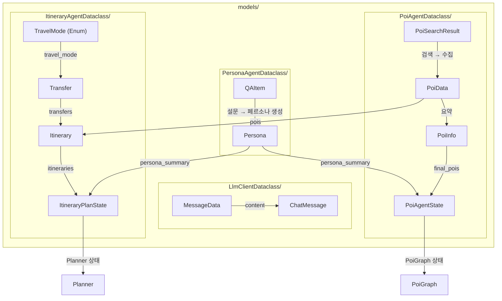

# Models

## 📁 개요

이 폴더는 **프로젝트 전반에서 사용되는 데이터 모델(Dataclass)**을 정의합니다. 각 에이전트 및 클라이언트별로 그룹화되어 있으며, Pydantic BaseModel을 기반으로 타입 안전성과 데이터 검증을 제공합니다.

---

## 📂 하위 폴더

| 폴더명 | 설명 | 주요 모델 |
|--------|------|-----------|
| [`LlmClientDataclass/`](./LlmClientDataclass/LLMClientDataclass.md) | LLM 클라이언트용 데이터 모델 | `MessageData`, `ChatMessage` |
| [`PersonaAgentDataclass/`](./PersonaAgentDataclass/PersonaAgentDataclass.md) | 페르소나 에이전트용 데이터 모델 | `QAItem`, `Persona` |
| [`PoiAgentDataclass/`](./PoiAgentDataclass/POIAgentDataclass.md) | POI 에이전트용 데이터 모델 | `PoiData`, `PoiSearchResult`, `PoiInfo`, `PoiAgentState` |
| [`ItineraryAgentDataclass/`](./ItineraryAgentDataclass/) | 여행 일정 에이전트용 데이터 모델 | `Transfer`, `Itinerary`, `ItineraryPlanState`, `TravelMode` |

---

## 🏗️ 모델 구조 요약

### LlmClientDataclass

LLM API 호출에 사용되는 채팅 메시지 형식

```
ChatMessgage
└── content: List[MessageData]
                  ├── role: str
                  └── content: str
```

---

### PersonaAgentDataclass

사용자 설문 응답 및 생성된 페르소나

```
QAItem                           Persona
├── id: int                      └── summary: str
├── question: str
└── answer: str | List[str]
```

---

### ItineraryAgentDataclass

여행 일정 생성 파이프라인에서 사용되는 데이터 모델

```
TravelMode (Enum)
├── DRIVING | WALKING | TRANSIT | BICYCLING

Transfer                         Itinerary
├── from_poi_id: str            ├── date: str (YYYY-MM-DD)
├── to_poi_id: str              ├── pois: List[PoiData]
├── travel_mode: TravelMode     ├── transfers: List[Transfer]
├── duration_minutes: int       └── total_duration_minutes: int
└── distance_km: float

ItineraryPlanState (LangGraph 상태)
├── pois, travel_destination, travel_start_date, travel_end_date
├── total_budget, persona_summary
├── itineraries, validation_feedback, schedule_feedback
├── is_poi_sufficient, poi_enrich_attempts
├── iteration_count, previous_poi_ids, is_poi_changed
├── best_itineraries
└── task_queue, current_task
```

---

### PoiAgentDataclass

POI 검색 파이프라인 전체에서 사용되는 데이터 모델

```
┌─────────────────┐     ┌──────────────────┐     ┌─────────────┐
│    PoiData      │     │  PoiSearchResult │     │   PoiInfo   │
│  (원본 데이터)   │────▶│   (검색 결과)     │────▶│ (최종 추천)  │
└─────────────────┘     └──────────────────┘     └─────────────┘

PoiAgentState (LangGraph 상태)
├── persona_summary
├── keywords
├── web_results / embedding_results
├── reranked_web_results / reranked_embedding_results
├── merged_results
└── final_pois
```

---

## 📊 모델 관계 다이어그램



---

## 🔗 공통 의존성

- `pydantic`: 데이터 검증 및 직렬화
- `typing`: 타입 힌트 (`List`, `Optional`, `Union`, `TypedDict`)
- `enum`: 열거형 정의
- `datetime`: 타임스탬프

---

## 📌 사용 패턴

### 모델 임포트

```python
# POI 에이전트 데이터 모델
from app.core.models.PoiAgentDataclass import (
    PoiCategory,
    PoiSource,
    PoiData,
    PoiSearchResult,
    PoiInfo,
    PoiAgentState,
)

# LLM 클라이언트 데이터 모델
from app.core.models.LlmClientDataclass.ChatMessageDataclass import (
    ChatMessgage,
    MessageData,
)

# 페르소나 에이전트 데이터 모델
from app.core.models.PersonaAgentDataclass.persona import (
    QAItem,
    Persona,
)
```

---

## 💡 발견된 클래스명 오타

| 현재 클래스명 | 올바른 클래스명 | 파일 |
|--------------|----------------|------|
| `ChatMessgage` | `ChatMessage` | `ChatMessageDataclass.py` |
