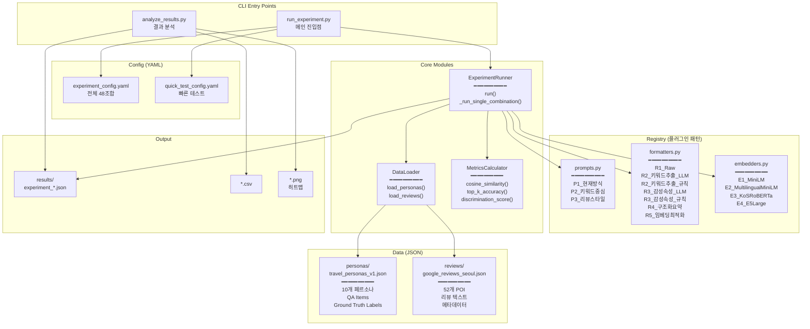
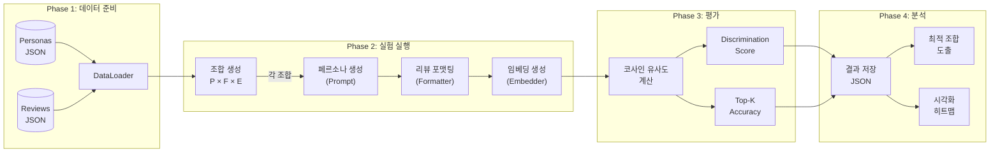
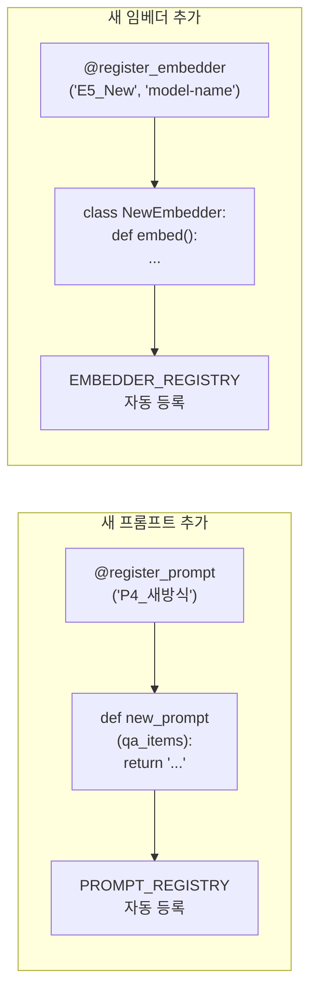
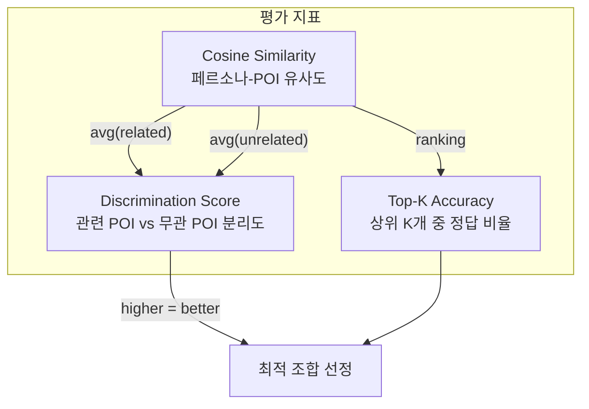

# Persona-Review Embedding Similarity Experiment Architecture

## 전체 구조



## 실험 파이프라인



## 레지스트리 패턴 (확장 방법)



## 파일 구조

```
persona_review_similarity/
├── __init__.py
├── run_experiment.py          # CLI 메인 진입점
├── analyze_results.py         # 결과 분석 및 시각화
├── ARCHITECTURE.md            # 이 문서
│
├── config/
│   ├── experiment_config.yaml # 전체 실험 설정 (3×4×4=48 조합)
│   └── quick_test_config.yaml # 빠른 테스트용 최소 설정
│
├── registry/                  # 플러그인 레지스트리
│   ├── __init__.py
│   ├── prompts.py             # P1-P3 페르소나 생성 프롬프트
│   ├── formatters.py          # R1-R5 리뷰 포맷터 (7개)
│   └── embedders.py           # E1-E4 임베딩 모델
│
├── core/                      # 핵심 로직
│   ├── __init__.py
│   ├── data_loader.py         # JSON 데이터 로더
│   ├── metrics.py             # 평가 지표 계산
│   └── experiment_runner.py   # 실험 실행 엔진
│
├── data/                      # 데이터셋
│   ├── personas/
│   │   └── travel_personas_v1.json
│   └── reviews/
│       └── google_reviews_seoul.json
│
└── results/                   # 실험 결과 출력
    └── *.json
```

## 실험 변수

### 페르소나 프롬프트 (P1-P3)

| ID | 이름 | 설명 | 출력 형태 |
|----|------|------|----------|
| P1 | 현재방식 | 1문장 한국어 요약 | "편안한 힐링을 최우선으로 하는 단기 여행자..." |
| P2 | 키워드중심 | 구조화된 키워드 리스트 | "선호: 온천, 카페 / 제약: 예산 / 우선순위: 휴식" |
| P3 | 리뷰스타일 | 가상 리뷰 형태 | "조용하고 힐링되는 곳을 찾았어요..." |

### 리뷰 포맷터 (R1-R5, 7개)

| ID | 이름 | 설명 | LLM 필요 |
|----|------|------|---------|
| R1 | Raw | PoiData.raw_text 원문 그대로 | No |
| R2a | 키워드추출_LLM | LLM으로 핵심 키워드 추출 | Yes |
| R2b | 키워드추출_규칙 | 규칙 기반 키워드 추출 | No |
| R3a | 감성속성_LLM | LLM으로 감성 태그 + 속성 | Yes |
| R3b | 감성속성_규칙 | 규칙 기반 감성 태그 + 속성 | No |
| R4 | 구조화요약 | PoiData 필드 구조화 통합 | No |
| R5 | 임베딩최적화 | 페르소나 스타일과 유사한 자연어 | No |

### 임베딩 모델 (E1-E4)

| ID | 모델명 | 차원 | 특징 |
|----|--------|------|------|
| E1 | all-MiniLM-L6-v2 | 384 | 현재 사용 중, 빠름 |
| E2 | paraphrase-multilingual-MiniLM-L12-v2 | 384 | 다국어 지원 |
| E3 | jhgan/ko-sroberta-multitask | 768 | 한국어 특화 |
| E4 | intfloat/multilingual-e5-large | 1024 | 고성능 다국어 |

## 평가 지표



## Config 파라미터 설명

### YAML 설정 파일 구조

```yaml
experiment:
  name: "experiment_name"           # 실험 이름 (결과 파일명에 사용)
  description: "실험 설명"           # 실험 목적 및 설명

datasets:
  personas: "path/to/personas.json" # 페르소나 데이터셋 경로
  reviews: "path/to/reviews.json"   # POI 리뷰 데이터셋 경로

variables:
  prompts:                          # 사용할 페르소나 프롬프트 목록
    - P1_현재방식
    - P2_키워드중심
  formatters:                       # 사용할 리뷰 포맷터 목록
    - R1_Raw
    - R4_구조화요약
  embedders:                        # 사용할 임베딩 모델 목록
    - E1_MiniLM
    - E3_KoSRoBERTa

metrics:                            # 계산할 평가 지표
  - cosine_similarity
  - discrimination_score
  - top_k_accuracy

output:
  results_dir: "results/"           # 결과 저장 디렉토리
  save_embeddings: true             # 임베딩 벡터 저장 여부
  export_csv: true                  # CSV 형식 내보내기 여부
```

### 파라미터 상세 설명

| 섹션 | 파라미터 | 타입 | 필수 | 설명 |
|------|----------|------|------|------|
| `experiment` | `name` | string | Yes | 실험 식별자. 결과 파일명: `{name}_{timestamp}.json` |
| `experiment` | `description` | string | No | 실험 목적 설명 (메타데이터용) |
| `experiment` | `use_travel_persona_agent` | bool | No | `true`: TravelPersonaAgent 사용, `false`: 프롬프트 직접 사용 (기본: `false`) |
| `datasets` | `personas` | string | Yes | 페르소나 JSON 경로 (절대/상대) |
| `datasets` | `reviews` | string | Yes | POI 리뷰 JSON 경로 (절대/상대) |
| `variables` | `prompts` | list | Yes | 레지스트리에 등록된 프롬프트 이름 목록 |
| `variables` | `formatters` | list | Yes | 레지스트리에 등록된 포맷터 이름 목록 |
| `variables` | `embedders` | list | Yes | 레지스트리에 등록된 임베더 이름 목록 |
| `output` | `results_dir` | string | No | 결과 저장 경로 (기본: `results/`) |
| `output` | `save_embeddings` | bool | No | 임베딩 벡터 저장 여부 (기본: `true`) |
| `output` | `export_csv` | bool | No | CSV 내보내기 여부 (기본: `true`) |

### 데이터셋 스키마

#### 페르소나 JSON (`personas/*.json`)

```json
{
  "version": "1.0",
  "personas": [
    {
      "id": "P001",                    // 고유 식별자
      "name": "힐링여행자",              // 페르소나 이름
      "itinerary_request": {           // TravelPersonaAgent 형식
        "tripId": 1,
        "travelCity": "서울",
        "totalBudget": 500000,
        "travelTheme": ["힐링", "휴식"],
        "wantedPlace": ["온천", "카페"],
        "arrivalDate": "2024-03-15",
        "departureDate": "2024-03-17"
      },
      "qa_items": [                    // Q&A 응답
        {"id": 1, "question": "여행 목적은?", "answer": "휴식과 힐링"}
      ],
      "related_poi_ids": ["POI001"],   // Ground Truth: 관련 POI
      "unrelated_poi_ids": ["POI006"]  // Ground Truth: 무관 POI
    }
  ]
}
```

#### POI 리뷰 JSON (`reviews/*.json`) — PoiData 스키마

```json
{
  "version": "1.0",
  "pois": [
    {
      "id": "POI001",                      // 고유 식별자 (필수)
      "name": "북한산 둘레길",               // POI 이름 (필수)
      "source": "web_search",              // PoiSource enum (필수)
      "raw_text": "북한산 둘레길. 도심 힐링...", // 원문 텍스트 (필수)
      "category": "attraction",            // PoiCategory enum
      "primary_type": "hiking_area",       // Google Maps 주요 유형
      "types": ["hiking_area", "park"],    // Google Maps 유형 배열
      "google_rating": 4.5,                // Google 평점
      "user_rating_count": 2847,           // 리뷰 수
      "price_level": "PRICE_LEVEL_FREE",   // 가격대
      "price_range": "₩0",                 // 가격 범위
      "editorial_summary": "도심 힐링 코스",  // Google 제공 요약
      "generative_summary": "AI 생성 요약",   // AI 요약
      "review_summary": "리뷰1 | 리뷰2"      // 상위 리뷰 결합
    }
  ]
}
```

### 실험 조합 계산

총 실험 조합 수 = `len(prompts) × len(formatters) × len(embedders)`

예시:
- 4 prompts × 5 formatters × 4 embedders = **80 조합**
- 각 조합당 `personas × pois` 유사도 계산

## 사용법

```bash
# 전체 실험 실행 (48 조합)
python run_experiment.py

# 빠른 테스트 (2 조합)
python run_experiment.py --config config/quick_test_config.yaml

# 특정 변수만 테스트
python run_experiment.py --prompts P1_현재방식,P3_리뷰스타일 --embedders E3_KoSRoBERTa

# 변수 목록 확인
python run_experiment.py --list-variables

# 결과 분석
python analyze_results.py results/experiment_name.json

# 히트맵 생성
python analyze_results.py results/experiment_name.json --plot

# CSV 내보내기
python analyze_results.py results/experiment_name.json --csv results/output.csv
```

## 확장 가이드

### 새 프롬프트 추가

```python
# registry/prompts.py에 추가
@register_prompt("P4_새로운방식", description="새로운 페르소나 생성 방식")
def new_style_prompt(qa_items: List[QAItem]) -> str:
    qa_text = "\n".join([f"Q: {item.question}\nA: {item.answer}" for item in qa_items])
    return f"""
    당신만의 프롬프트 템플릿...
    {qa_text}
    """
```

### 새 포맷터 추가

```python
# registry/formatters.py에 추가
@register_formatter("R6_새포맷", description="새로운 리뷰 포맷팅", requires_llm=False)
def new_formatter(poi: PoiData, **kwargs) -> str:
    # PoiData 필드를 활용한 포맷팅 로직
    return f"{poi.name}: {poi.review_summary or poi.raw_text}"
```

### 새 임베더 추가

```python
# registry/embedders.py에 추가
@register_embedder("E5_NewModel", "huggingface/model-name", description="새 모델", dimension=512)
class NewModelEmbedder(SentenceTransformerEmbedder):
    pass  # 기본 구현 사용 또는 오버라이드
```

### 새 데이터셋 추가

1. `data/personas/` 에 새 JSON 파일 생성
2. `data/reviews/` 에 새 JSON 파일 생성
3. 실행 시 경로 지정: `--personas data/personas/new_data.json`
